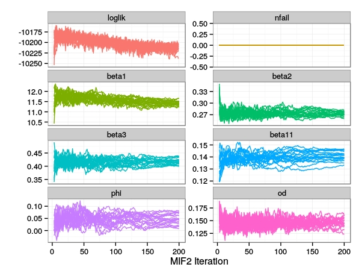

```{r knitr-opts,include=FALSE,purl=FALSE,cache=FALSE}
source("setup.R", local = knitr::knit_global())
```
```{r options,include=FALSE,cache=FALSE}
require(pomp)
require(ggplot2)
theme_set(theme_bw())
set.seed(1810027260)
```

```{css echo=FALSE}
#TOC ul li {
    list-style: none;
}
.header-section-number:after, .toc-section-number:after {
    content: ".";
}
```

# General.

## How can I submit an effective request for help? {#effective-request}

Before submitting a request, first see if you can solve your own problem.

1. Check to see if you are using the latest version of **pomp**:
if not, check to see if the problem you have is solved by upgrading to the latest version.
1. Before submitting a request, examine the error messages and try to figure out what they are telling you by reading the [help pages](./manual/) and/or the [package tutorials](./docs.html).
1. Read through the [Frequently Asked Questions](./FAQ.html) to see if the answer to your question is there.
1. Check the [discussions forum](https://github.com/kingaa/pomp/discussions/).
Many conversations about various situations that have arisen are archived there.
1. Search the [issues](https://github.com/kingaa/pomp/issues/) (including the closed issues) to see if your situation has been encountered and resolved already.

If you still have a problem, then submit a request for help via the [Issues page](https://github.com/kingaa/pomp/issues) if possible or to Aaron King (kingaa at umich dot edu) if necessary.
***Include in your request---at a minimum---the code that you ran that produced the error, together with a transcript of the **R** session that gave the errors.***
Better still, construct a minimal example that will reproduce the error: this allows for the most efficient solution of problems.

Make sure to include the output of following, so that I can see what version of **pomp** you are using, what version of **R**, what kind of machine you have, any customizations you have that might be affecting performance, etc.

```
source("https://kingaa.github.io/scripts/diagnostics.R")
```

## What's the proper way to cite **pomp**? {#cite-pomp}

```{r echo=FALSE,results="asis"}
print(citation("pomp"),bibtex=FALSE)
```

You can get this information by executing `citation("pomp")` in an **R** session.
LaTeX users can get a BibTeX entry for these publications by executing `toBibtex(citation("pomp"))`.

If you use **pomp** in a publication, please take a moment to let us know!
Send an email with the citation, and we'll include it in [the bibliography](./biblio.html).

## I have an error message that I don't understand, and my question isn't answered below. How can I get help? {#help-with-error-message}

There are many resources available that can help.
First, check the [package manual](./manual/) to see if it describes the situation you have encountered.
Second, check the [discussions forum](https://github.com/kingaa/pomp/discussions/).
Many conversations about various situations that have arisen are archived there.
Third, search the [issues](https://github.com/kingaa/pomp/issues/) (including the closed issues) to see if your situation has been encountered and resolved already.
Finally, feel free to [submit an issue](https://github.com/kingaa/pomp/issues).
In doing so, display the error message you get and document how it arises.
Please [follow the instructions in FAQ 1.1 above](#effective-request).

The pomp developers have a goal of replacing all unhelpful error messages with helpful ones.
By letting us know when messages are confusing or uninformative, you help us to make the package more usable.

## I am running a piece of **pomp** code I found on the web, but I get errors. What is going on? {#old-code}

Of course, there could be many reasons for this.
However, you should know that **pomp** version 2 made many changes to the **pomp** interface so that older code will not run under versions &ge; 2.
See the [**pomp** version 2 upgrade guide](./upgrade_guide.html) for information on how to fix broken code from earlier versions.

## Where in the peer-reviewed literature is **pomp** described?

The paper announcing **pomp** was published in the *Journal of Statistical Software* [@King2016].
An [updated version of that paper can be found on the **pomp** website](./vignettes/pompjss.pdf).

The video and visual aids from a talk entitled "Two perspectives on the **pomp** project", which describes the goals and organization of the package from both the user's and developer's persectives is also [linked from the website](./docs.html).

# Installation problems

## How do I install **pomp**? {#install-pomp}

See the [installation instructions](./install.html).

## Why do I get an error message about `gfortran` when I try to install **pomp** from source on my Mac? {#mac-gfortran}

Compilation of **pomp** requires a FORTRAN compiler, which has not been installed (or not installed properly) on your system.
See the [installation instructions](./install.html#important-note-for-mac-os-x-users).

## I am using **R** version X. When I try to install the package, I get the error that "package **pomp** is not available (for R version X)". Yet it is stated that **pomp** is compatible with R(&ge;Y), where X > Y. What is going wrong? {#old-R}

Firstly, as a general rule, it's very probably a good idea to simply install the latest version of **R**, since each new release fixes bugs, adds and improves features, etc.

Usually, this warning arises because you are trying to install binaries from a repository on which binaries built for your version of **R** are no longer available.
The preferred solution in this case is, again, to upgrade **R**, but if for some reason that is impossible or undesirable, you can always build the package from source using the source code retrieved from the [package website](https://kingaa.github.io/pomp/) or from one of the [CRAN mirrors](https://cran.r-project.org/mirrors.html).
For more, see the [installation instructions](./install.html).

To be clear: the statement that pomp will work for **R**(>=Y) is a guarantee that the code is compatible with those versions of **R**.
It is not a promise that binaries will always be available for old versions of **R**.

# Implementing POMP models.

## How can I include a vector of variables in a C snippet? {#vector-in-csnippet}

A C snippet can make use of any feature of the C language.
In particular, we can use pointers to give access to arrays.
For example, consider the following, which implement a simple chain of random variables.

```{r vector-vars-csnips}
rSim <- Csnippet("
  double *x = &X1;
  int i, n = (int) N;
  for (i = 0; i < n-1; i++) x[i] = x[i+1];
  x[n-1] = rnorm(0,1);
")

rInit <- Csnippet("
  double *x = &X1;
  int i, n = (int) N;
  for (i=0; i < n; i++) x[i] = 0.0;
")

rMeas <- Csnippet("
  Y1 = rnorm(X2,2);
")
```

The following simulates and plots using the above.

```{r vector-vars-pomp}
library(ggplot2)
library(tidyr)

simulate(
  times=1:20,t0=0,
  rprocess=euler(rSim,delta.t=1),
  rmeasure=rMeas,
  rinit=rInit,
  obsnames="Y1",
  statenames=sprintf("X%d",1:5),
  paramnames="N",
  params=c(N=5),
  format="data.frame"
) %>%
  melt(id=c("time",".id")) %>%
  ggplot(aes(x=time,y=value,group=variable,color=variable))+
  geom_line()+theme_bw()
```

## Can I write a `pomp` for multivariate data? {#multivariate-data-pomp}

Yes, this is no problem.
The `data` you supply to `pomp` can contain multiple variables.
You simply refer to these variables by name in writing the `rmeasure` and `dmeasure` C snippets.
The following example illustrates this for a multivariate Ornstein-Uhlenbeck process (as in `pompExample("ou2")`) with a slightly peculiar measurement model.
```{r multivariate-data-pomp}
simulate(
  times=1:100, t0=0,
  rmeasure=Csnippet("
        y1 = rnorm(x1+x2,sigma1);
        y2 = rnorm(x2-x1,sigma2);
        "),
  dmeasure=Csnippet("
        lik = dnorm(y1,x1+x2,sigma1,1)+dnorm(y2,x2-x1,sigma2,1);
        lik = (give_log) ? lik : exp(lik);
        "),
  rprocess=discrete_time(
    step.fun=Csnippet("
        double tx1, tx2;
        tx1 = rnorm(a11*x1 + a12*x2,nu1);
        tx2 = rnorm(a21*x1 + a22*x2,nu2);
        x1 = tx1; x2 = tx2;
      "),
    delta.t=1),
  rinit=Csnippet("
        x1 = 0;
        x2 = 0;
        "),
  obsnames=c("y1","y2"),
  statenames=c("x1","x2"),
  paramnames=c("a11","a12","a21","a22","sigma1","sigma2","nu1","nu2"),
  params=c(a11=0.5,a12=-0.1,a21=0.2,a22=-1,nu1=0.3,nu2=0.1,sigma1=0.1,sigma2=0.3)
) -> obj
```

```{r multivariate-data-check,include=FALSE}
obj %>% pfilter(Np=1000) %>% logLik()
```

## How do I deal with missing data? {#how-to-handle-missing-data}

Missing data are a common complication.
**pomp** can handle NAs in the data, but if it is needed, the measurement model probability density function, `dmeasure` must be written so as to deal with NAs appropriately.
For example, look at the following variant of [the SIR model describing the influenza outbreak in a boarding school](https://kingaa.github.io/sbied/stochsim/stochsim.html):

```{r}
library(ggplot2)

read.csv(text="
B,day
NA,0
1,1
6,2
26,3
73,4
NA,5
293,6
258,7
236,8
191,9
124,10
69,11
26,12
11,13
4,14
") -> dat

dat %>%
  ggplot(aes(x=day, y=B)) +
  geom_line() + geom_point()
```

Data are missing at days 0 and 5.

We create a `pomp` object implementing a simple SIR process model and a binomial measurement model, as in the [original example](https://kingaa.github.io/short-course/stochsim/stochsim.html#the-boarding-school-flu-outbreak).
The only difference is in the `dmeasure`:

```{r}
library(pomp)

sir_step <- Csnippet("
  double dN_SI = rbinom(S,1-exp(-Beta*I/N*dt));
  double dN_IR = rbinom(I,1-exp(-gamma*dt));
  S -= dN_SI;
  I += dN_SI - dN_IR;
  R += dN_IR;
  H += dN_IR;
")

sir_init <- Csnippet("
  S = N-1;
  I = 1;
  R = 0;
  H = 0;
")

rmeas <- Csnippet("B = rbinom(H,rho);")

dmeas <- Csnippet("
  if (ISNA(B)) {
    lik = (give_log) ? 0 : 1;
  } else {
    lik = dbinom(B,H,rho,give_log);
  }
")

dat %>%
  pomp(time="day",t0=0,
       rprocess=euler(sir_step,delta.t=1/12),
       rinit=sir_init,
       rmeasure=rmeas,
       dmeasure=dmeas,
       accumvars="H",
       paramnames=c("Beta","gamma","N", "rho"),
       statenames=c("S","I","R","H")
  ) -> sir_na
```

In the above, to check for missing data, we use the `ISNA` macro, which is [part of **R**'s C API](https://cran.r-project.org/doc/manuals/r-release/R-exts.html#Missing-and-special-values).
Note that the `dmeasure` returns a likelihood of 1 (log likelihood 0) for the missing data.
[What's the probability of seeing something if you don't look?]
When there is an observation, it returns a binomial likelihood as usual.

Our simulations now fill in simulated values for the missing data,

```{r}
sir_na %>%
  simulate(
    params=c(Beta=3,gamma=2,rho=0.9,N=2600),
    nsim=10,
    format="data.frame",
    include.data=TRUE
  ) %>%
  ggplot(aes(x=day,y=B,group=.id,color=.id=="data"))+
  geom_line()+
  guides(color="none")+
  theme_bw()
```

and the particle filter handles the missing data correctly:

```{r}
sir_na %>%
  pfilter(Np=1000,params=c(Beta=3,gamma=2,rho=0.9,N=2600)) %>%
  as.data.frame() %>%
  melt(id="day") %>%
  ggplot(aes(x=day,y=value,color=variable))+
  guides(color="none")+
  geom_line()+
  facet_wrap(~variable,ncol=1,scales='free_y')+
  theme_bw()
```

In the above particle filter computation, notice that the effective sample size (ESS) is full, as it should be, when the missing data contribute no information.


## I have t0 much less than t[1].  How do I deal with accumulator variables in this case?  {#t0-much-less-than-t1-accumulators}

As described in the documentation ([`?pomp`](https://kingaa.github.io/manuals/pomp/html/pomp.html)), **pomp** allows you to define "accumulator variables" that collect events occurring between observations.
The example [above](#how-to-handle-missing-data) illustrates this.

In that example, we took `t0` equal to the first observation time.
Sometimes we want to take `t0` to be much earlier.
For example, if we wish to posit that the initial state of the unobserved Markov process is distributed at `t0` according to its stationary distribution, one way to achieve this is to put `t0` so early that simulations will equilibrate before the first observation is made.

This is straightforward, but the presence of accumulator variables leads to a small twist.
Let's look at the boarding-school flu example to illustrate.

```{r}
library(pomp)

sir_step <- Csnippet("
  double dN_SI = rbinom(S,1-exp(-Beta*I/N*dt));
  double dN_IR = rbinom(I,1-exp(-gamma*dt));
  S -= dN_SI;
  I += dN_SI - dN_IR;
  R += dN_IR;
  H += dN_IR;
  ")

sir_init <- Csnippet("
  S = N-1;
  I = 1;
  R = 0;
  H = 0;
")

rmeas <- Csnippet("B = rbinom(H,rho);")

dmeas <- Csnippet("if (ISNA(B)) {
                  lik = (give_log) ? 0 : 1;
} else {
                  lik = dbinom(B,H,rho,give_log);
}")

read.csv(text="
day,B
1,3
2,8
3,28
4,76
5,222
6,293
7,257
8,237
9,192
10,126
11,70
12,28
13,12
14,5
") -> dat

dat %>%
  pomp(time="day",t0=-8,
       rprocess=euler(sir_step,delta.t=1/12),
       rinit=sir_init,
       rmeasure=rmeas,
       dmeasure=dmeas,
       accumvars="H",
       paramnames=c("Beta","gamma","N", "rho"),
       statenames=c("S","I","R","H")
  ) -> bsflu
```

Note that, as [above](#how-to-handle-missing-data), we've allowed for the possibility of NAs in the data.

Now let's look at the data and some simulations from the model.

```{r}
library(ggplot2)

bsflu %>%
  as.data.frame() %>%
  ggplot(aes(x=day,y=B))+
  geom_point()+geom_line()+
  theme_bw()

bsflu %>%
  simulate(params=c(Beta=1.5,gamma=1,rho=0.9,N=2600),
           nsim=10,format="d",include.data=TRUE) %>%
  ggplot(aes(x=day,y=B,group=.id,color=.id=="data"))+
  geom_line()+
  guides(color="none")+
  theme_bw()
```

The data plot looks fine, but what's going on with the simulations?
It's easy to understand: we are assuming that there is one infectious host at `t = t0 = -8` days.
In most of the simulations, this leads to a number of new infections, which the `H` variable accumulates from `t=-8` to `t=1`, the time of our first observation.
But our first observation is not the number of new cases to have occurred in the last 9 days, but the number that occurred (and were reported) in the last 1 day.

We can fix this by introducing a fictitious "observation" at `t=0`, with missing data, i.e., by assuming we observed nothing at `t=0`:

```{r}
library(dplyr)

dat %>%
  bind_rows(c(day=0,B=NA)) %>%
  arrange(day) %>%
  pomp(time="day",t0=-8,
       rprocess=euler(sir_step,delta.t=1/12),
       rinit=sir_init,
       rmeasure=rmeas,
       dmeasure=dmeas,
       accumvars="H",
       paramnames=c("Beta","gamma","N", "rho"),
       statenames=c("S","I","R","H")
  ) -> bsflu

bsflu %>%
  simulate(params=c(Beta=1.5,gamma=1,rho=0.9,N=2600),
    nsim=10,format="d",include.data=TRUE) %>%
  filter(day>0) %>%
  ggplot(aes(x=day,y=B,group=.id,color=.id=="data"))+
  geom_line()+
  guides(color="none")+
  theme_bw()
```

## What is the best measurement model to use? {#what-is-the-best-measurement-model}

The answer to this question depends on the nature of the data.
The measurement model is as much a part of the model as the latent process model. Accordingly, the choice of the measurement model is governed by the same considerations: 
Which model fits the data best? 
Which model has the greater predictive power?
Which model makes the most sense?

Nor is the choice of the measurement model without consequences for the choice of the latent process model.
Despite the fact that one typically is much more interested in the latent process than in the measurement, if one does not pay careful attention to both, one risks making incorrect or sub-optimal inference.

## What is the Euler-multinomial approximation? {#eulermultinomial-approximation}

The Euler multinomial approximation of a continuous-time, stochastic compartmental model is as follows.
Suppose a compartment has occupancy $N_t$ at time $t$ and that there are $K$ ways of exiting the compartment, with per capita rates (hazards) $\mu_1,\dots,\mu_K$, respectively.

-----

```{r compartment-diagram,echo=FALSE,purl=FALSE,out.width="200px",out.height="200px",dpi=100,fig.height=3,fig.width=3,fig.align="center",fig.cap="**Diagram:** *A single compartment within a compartmental model.  Here, there are $K=2$ paths out of the compartment.*"}
library(grid)
vp <- viewport(width=unit(0.95,"npc"),height=unit(0.95,"npc"))
pushViewport(vp)
grid.rect(x=c(1/4),y=3/4,width=1/2,height=1/2,just=c(0.5,0.5),gp=gpar(fill="white",lwd=3))
grid.text(x=c(1/4),y=3/4,label=c(expression(N[t])),gp=gpar(fontsize=36))
grid.text(x=unit(c(3/4,1/4),"npc")+unit(c(0,18),"point"),y=unit(c(3/4,1/4),"npc")+unit(c(18,0),"point"),
          label=c(expression(mu[1]),expression(mu[2])),gp=gpar(fontsize=24))
grid.lines(x=c(1/2,1),y=3/4,arrow=arrow(length=unit(0.04,"npc")),gp=gpar(lwd=3))
grid.lines(x=c(1/4),y=c(1/2,0),arrow=arrow(length=unit(0.04,"npc")),gp=gpar(lwd=3))
popViewport()
```

-----

To make the Euler multinomial approximation, we approximate the total exit rates as constant over a small interval $[t,t+{\Delta}t)$.
Let the random variable ${\Delta}n_k$, $k=1,\dots,K$, be the number that exit by path $k$ in this time interval and ${\Delta}n_0$ be the number that remain.
Under this assumption, the vector of numbers of exits, $({\Delta}n_{0},{\Delta}n_{1},\dots,{\Delta}n_{K})$ is multinomially distributed with size $N_t$ and probabilities $(p_k)_{k=0}^K$, where 
$$p_0 = \exp\left(-\sum\!\mu_i\,{\Delta}t\right),$$
and
$$p_k = \frac{\mu_k}{\sum\!\mu_i}\,\left(1-p_0\right),\qquad k=1,\dots,K.$$
By way of shorthand, we say that ${\Delta}n=({\Delta}n_k)_{k=1}^K$ is *Euler-multinomially distributed* with size $N_t$, rates $\mu=(\mu_k)_{k=1}^K$, and time-step ${\Delta}t$ and we write
$${\Delta}n \sim \mathrm{Eulermultinom}\left(N_t,\mu,{\Delta}t\right).$$

When constructing a POMP for a compartmental model using the Euler multinomial approximation, to write the rprocess basic component, one uses the `euler` plugin.
One chooses the time step using the `delta.t` argument.
In writing the `step.fun` C snippet, one needs *exactly one* call to `reulermultinom` for each compartment of the model.
Using the notation above, one has to pack the $K$ rates $\mu_1,\dots,\mu_K$ into contiguous memory locations and retrieve the results in (a different set of) contiguous memory locations.
For example, if `rate` is a [pointer](https://www.tutorialspoint.com/cprogramming/c_pointers) to $K$ contiguous memory locations holding the rates and `dn` is a pointer to $K$ contiguous memory locations ready to hold the results, then
```
reulermultinom(K,N,rate,dt,dn);
```
will result in a random sample from the Euler multinomial distribution (with timestep dt) being stored in `dn[0]`, ..., `dn[K-1]`.
In the foregoing, we've assumed that the quantities $N_t$ and $K$ are stored in the memory locations denoted `N` and `K`, respectively.
Note that the rules for `step.fun` C snippets guarantee that the operative time step (${\Delta}t$) is stored in `dt` and that this will not exceed the user-specified `delta.t`.
See [`?rprocess_spec`](https://kingaa.github.io/manuals/pomp/html/rprocess_spec.html) and [`?Csnippet`](https://kingaa.github.io/manuals/pomp/html/csnippet.html) for more information.

When the step function is provided as an **R** function, the corresponding call is
```
dn <- reulermultinom(n=1,size=N,rate=mu,dt=delta.t)
```
where `mu` is a vector containing the rates.

The [manual page](https://kingaa.github.io/manuals/pomp/html/distributions.html) contains more information on the Euler-multinomial distribution.

## Can I link a C library with my C snippets? {#linking-C-libraries}

Yes, this is straightforward.
One can make use of the `globals` and `shlib.args` arguments to do so.

Any valid C code passed to `globals` is included at the top level of the C file containing C snippets.
For example, any variables or functions defined there will be visible to every C snippet in that file.
If one wishes to call functions defined in a precompiled C library, one can include the library's header file via the usual `#include` statement, passed via the `globals` argument.

Any text passed to the `shlib.args` argument is included in the command-line call to `R CMD SHLIB`.
To link to a precompiled library, then, one can do something like
```
  shlib.args = "<library>"
```
where `<library>` is the path of the library.

Consider the following simple example.
The function `truncated_normal_a_pdf` is defined in the library `libtn.so`, located in directory `libs`.
It has a header file, located in `include/tn.h`.

```{r tn-build,include=FALSE}
dir.create("include",showWarnings=FALSE,recursive=TRUE)
dir.create("libs",showWarnings=FALSE,recursive=TRUE)
file.copy("src/tn.h","include")
system("gcc -fpic -shared -o libs/libtn.so src/tn.c")
```
```{r tn-run,results="hide"}
simulate(
  t0 = 0,
  times = 0:100,
  obsnames = "y",
  rprocess=discrete_time(
    step.fun=Csnippet("
      double e = rnorm(0,sigma);
      N = exp(log(r)+log(N)-N+e);"),
    delta.t=1
  ),
  rmeasure = Csnippet("
      y = rnorm(N,4);
      y = (y > 0) ? y : 0;"
  ),
  dmeasure = Csnippet("
      lik = truncated_normal_a_pdf(y,N,4,0);
      if (give_log) lik = log(lik);"
  ),
  statenames = "N",
  paramnames = c("r", "sigma"),
  params = c(N_0 = 7, r = 45, sigma = 0.3),
  globals = sprintf("#include \"%s\"","include/tn.h"),
  shlib.args = "libs/libtn.so"
) -> rick

rick |>
  pfilter(Np=1000) |>
  logLik()
```
```{r tn-clean,include=FALSE}
unlink(c("include","libs"),recursive=TRUE)
```

In [Discussion #156](https://github.com/kingaa/pomp/discussions/156) there is another simple example.

# Error messages and warnings. {#error-messages}

## I see an error about `dmeasure` returning illegal values.  What does it mean? {#illegal-dmeasure}

A common error message is 
```
Error : in ‘pfilter’: ‘dmeasure’ returns illegal value
```

This error arises because your `dmeasure` function is giving a negative, infinite, `NA`, or otherwise illegal value of the likelihood.
Common causes are:

- negative or non-integer state variables when the dmeasure assumes non-negative or integer values,
- missing data,
- the `dmeasure` function or C snippet returning the log likelihood when the likelihood is requested, or vice versa.
- `lik` has not been set properly. Note that, when the snippet is executed, `lik` will be undefined. In particular, you cannot assume that it has value 0.

See the help ([`?Csnippet`](https://kingaa.github.io/manuals/pomp/html/csnippet.html)) for information on how to properly write `dmeasure` C snippets.
As of version 1.5.6.3, when this error occurs, the values of the likelihood, parameters, and states are printed.
If this alone doesn't make the underlying cause clear, explore the model behavior further.
A useful way to do this is to put [`Rprintf` statements](https://cran.r-project.org/doc/manuals/r-release/R-exts.html#Printing) in your `dmeasure` and `rprocess` C snippets to view the values of the data, state variables, and likelihoods.
[Issue #13](https://github.com/kingaa/pomp/issues/13) has an example.

Remember, `dmeasure` has to be able to return the likelihood---or the log likelihood---upon request!

## Why can't I run the demos, or other codes that use the C snippet facility? {#why-cant-i-run-csnippets}

If your system does not support `R CMD SHLIB`, you won't be able to use C snippets.
**R** compiles native codes (C, C++, and FORTRAN) into shared-object libraries using `SHLIB`.
To check whether your **R** installation is configured to use `SHLIB`, run the following code snippet in an **R** session:
```{r eval=FALSE}
cat(
  "#include <R.h>
   void hello (void) {
     Rprintf(\"hello world!\\n\");
   }",
  file="hello.c")

system("R CMD SHLIB hello.c")
dyn.load(paste0("hello",.Platform$dynlib.ext))

.C("hello",PACKAGE="hello")
```
If it works, you should see
```
hello world!
list()
```
If it doesn't work, consult the [installation instructions](./install.html).


## Why do I get an error message "Could not compile shared-object library" when I run `pomp`? {#could-not-compile}

See [the preceding FAQ](#why-cant-i-run-csnippets).

Also, some Windows users have reported trouble with certain parallel codes.
Specifically, **pomp** codes that require compilation of C snippets trigger errors when executed in parallel on certain Windows machines.

The workaround is to execute *serially* all codes that require compilation;
that is, to execute them *outside* of all parallel code blocks.

Calls that induce compilation include:

1. Every call to a **pomp** function in which a basic model component is specified using a C snippet.
Recall that the basic model components include `rmeasure`, `dmeasure`, `rprocess`, `dprocess`, `skeleton`, `rprior`, `dprior`, `partrans`, and `rinit`.
Whenever one of these arguments is furnished a `Csnippet`, the snippet is compiled.  
2. Every call to a **pomp** function in which a parameter transformation is specified by giving the names of parameters to log-transform, logit-transform, or log-barycentric transform.
Even though the user does not supply a `Csnippet` in such cases, each such call results in a `Csnippet` being written internally, and then compiled.

In addition, the use of temporary directories to hold the C files and dynamically loadable libraries created from them that underlie the C snippet facility causes problems on certain Windows machines.
We hypothesize that this is due to Windows securities features.

Again, there is a workaround.
One can specify to **pomp** that all compilation should be done in the current working directory.

An illustration is given in the [Simulation-based Inference for Epidemiological Dynamics](https://kingaa.github.io/sbied/mif/windows.html) short course.

## I get the error message 'could not find symbol "recursive" in environment of the generic function' when I use the `c` operator to concatenate certain kinds of **pomp** structures. How do I fix this?  {#could-not-find-symbol-recursive}

This appears to arise from incompatibility between certain **R** installations and binary versions of the **pomp** package from CRAN.
Try installing the latest version from the github site:

```{r eval=FALSE}
install.packages("pomp",repos="https://kingaa.github.io/")
```

If you continue to see the error, try installing from source.
The easiest way to do this is to use **devtools**:

```{r eval=FALSE}
devtools::install_github("kingaa/pomp")
```

For more help with installation, see the [installation instructions](./install.html).

If these steps do not solve the problem, please [open an issue](https://github.com/kingaa/pomp/issues).
In doing so, please [follow the instructions in FAQ 1.1 above](#effective-request).

## I get warnings about extrapolation in 'table_lookup'. What is this about? {#extrapolation-warnings}

**pomp** incorporates time-varying covariates via a lookup table.
Whenever your model needs the value of a covariate at a particular time, it uses the lookup table provided (via the `covar` and `tcovar` options of `pomp`), linearly interpolating if necessary.
It can happen that the required computation depends on values of the covariates *outside* the time interval covered by the lookup table.
When this happens, **pomp** does linear extrapolation, with a warning.

This can be a problem if the linear extrapolation is not accurate.
To avoid this, be sure to give values for the covariates over a time interval that covers the full range of relevant times, i.e., `t0` to the time of the last observation.

Note that the ODE integration algorithms underlying `trajectory` can sometimes evaluate the covariates beyond the last observation time.
To avoid warnings (and the potential inaccuracy they signal) in this case, it may be necessary to supply values for the covariates somewhat beyond the final observation time.

## When trying to use C snippets, I get an error message that refers to files and directories that don't exist. What is going on? {#whitespace-error}

See [Issue 115](https://github.com/kingaa/pomp/issues/115) for an example.
This can happen if you use file or directory names that contain whitespace. 
For the tools that compile the C snippets---as with (all?) other command-line tools---whitespace is syntactic.
By far the best solution to this problem is to ***avoid using whitespace altogether in file and directory names***!
The standard choice is to substitute the underscore "_" for whitespace.

## 'Warning: "beta" redefined.' {#beta-redefined}

Error messages containing the following elements often arise.

```
...
Error: error in building shared-object library from C snippets:
in ‘Cbuilder’: compilation error: cannot compile shared-object library 
...
compiler messages:
...
warning: "beta" redefined
...
```

This is due to a name conflict between a quantity `beta` defined as a model parameter, covariate, data variable, or in some other way defined in a C snippet, and the [*Euler beta function*](https://en.wikipedia.org/wiki/Beta_function), which is defined as `beta` in `Rmath.h` and documented in the [R extensions manual](https://cran.r-project.org/doc/manuals/r-release/R-exts.html#Mathematical-functions).
To work around this, simply rename the parameter.
For example, it could be called `Beta` instead.

## I get an error saying X "must be a function of prototype" Y.  What does this mean?

The error message displays the "prototype" of the function **pomp** expects.
For example, in the message
```
Error : in 'sannbox': 'candidate.dist' must be a function of prototype 'candidate.dist(par, temp, scale, ...)'.
```
the prototype expected is `candidate.dist(par, temp, scale, ...)`.
This means that a function supplied to the `candidate.dist` argument must have at least the arguments `par`, `temp`, `scale`, and `...`.
Note that the ellipses (`...`) are necessary.
Similarly, the error message
```
Error: in ‘rmeasure’: ‘rmeasure’ must be a function of prototype ‘rmeasure(...)’
```
tells us that we have left the `...` out of the argument list in the function we supplied for `rmeasure`.

# Interpreting results

## Is the likelihood `mif2` gives me the same as the likelihood I get from `pfilter`? {#mif-vs-pfilter-likelihood}

No.  As its name suggests, the iterated filtering (IF) algorithm (that implemented in **pomp** as `mif2`) work by iteratively performing particle filtering on a model, but that model is slightly different from the focal model.
In particular, IF pertubs the parameters of the model by adding random noise to them.
Actually, if one were to simulate from this model, the parameters would be taking random walks.
This effectively smooths the likelihood surface, combats particle depletion, and---critically for IF---allows local exploration of the parameter space.
The likelihood that `mif2` reports is the estimated likelihood of this perturbed model.
It can be either higher or lower than that of the focal model.
Iterated filtering works by gradually reducing the magnitude of the perturbations with successive iterations ("cooling"), so that the perturbed model gradually becomes more similar to the focal model.

To compute the likelihood at a point returned by `mif2`, it is necessary to re-run the particle filter.
By doing the latter several times, one can obtain a more accurate estimate of the likelihood along with a measure of the associated uncertainty.

## Why does the likelihood seem to be decreasing, not increasing, with `mif2` iterations? {#decreasing-mif-likelihood}

In [Issue 27](https://github.com/kingaa/pomp/issues/27), \@theresasophia asked this question.
She provided codes for an estimation procedure based on `mif2`.
The plot below illustrates what she found.

-----------------------



-----------------------

The plots above show that, after a few iterations during which it rapidly increases, the `mif2` likelihood displays a slow downward trend.
However, the `mif2` likelihood is not identical to the true likelihood (see [FAQ 5.1](#mif-vs-pfilter-likelihood)).
This is because `mif2` adds extra variability to the model in the form of random perturbations to the parameters.
In effect, the model `mif2` sees is different from the model of interest.
Indeed, `mif2` works by gradually reducing the intensity of this extra variability, allowing one model to converge to the other.
We refer to this gradual reduction as "cooling".
In the following, "MOI" refers to the model of interest and "MM" to the corresponding model that `mif2` sees.
You can estimate the true likelihood of the MOI using `pfilter`.
For example, it is informative to compare the MOI likelihood at the end of the 200 `mif2` iterations above to that after, say, iteration 20.

Doing so will reveal that either (1) the MOI likelihood is stable or growing or (2) the MOI likelihood, like the MM likelihood, is declining.
These two cases have different interpretations.

1. If the MOI likelihood is stable or growing, then `mif2` is doing its job, which is to maximize the likelihood of the MOI. 
2. If the MOI likelihood is dropping, one possibility is that the `mif2` cooling is happening too quickly.
3. Alternatively, if the MOI likelihood is indeed dropping, it is possible that the MM fits the data somewhat better than the MOI. 
This in turn suggests that the MOI may lack the variability needed to explain the data well. 
In other words, a model with more variability than is possible in the MOI may be needed to explain the variability in the data, at least in the parameter regimes so far explored.

See also [Issue 27](https://github.com/kingaa/pomp/issues/27).

# Algorithm settings

## What are "parameter transformations" (`partrans`, `parameter_trans`) in **pomp** and when should I use them? {#partrans}

It is frequently the case that the parameters of a model make sense only for some restricted set of values.
For example, rates are typically positive numbers, and probabilities must be between 0 and 1.
Put another way, the parameter space that is to be searched is *constrained*.
Many powerful estimation algorithms, however, are *unconstrained optimization algorithms*, i.e., they assume that the parameter space to be searched is Euclidean space $\mathbb{R}^n$.
These algorithms will therefore potentially explore regions of parameter space for which the model constraints are violated (e.g., negative rates and probabilities $>1$.)
One way to enforce the constraints is to transform the model parameter space so as to remove the constraints.
Thus for example, the logarithm transforms the space of positive rates onto the real line and the *logit* function (the log-odds-ratio) transforms the unit interval $(0,1)$ onto the real line.

To accommodate this approach, **pomp** provides a facility for the user to supply such parameter transformations.
These transformations take the parameters on the "natural scale" to another "estimation scale".
One specifies parameter transformations using the `parameter_trans` function, passing its output to the `partrans` argument to any **pomp** estimation algorithm (or to the basic constructor, `pomp`).
For convenience, shortcuts for the commonly used log, logit, and log-barycentric transformations are provided.
[Note that the latter use C snippets internally, so that the `paramnames` argument must be specified when the `log`, `logit`, or `barycentric` arguments of `parameter_trans` are used.]
See the [`parameter_trans` manual page](https://kingaa.github.io/manuals/pomp/html/parameter_trans.html) for more detail.

## Iterated filtering (`mif2`)

### How should I choose the random-walk intensities (`rw.sd`)? {#rw-sd-choice}

First, some background on how the iterated filtering (IF2) algorithm works. 
As its name suggests, IF2 (implemented as `mif2` in **pomp**) essentially iterates a particle filter. 
It does this `Nmif` times. 
Crucially, however, it does this not using the exact model you've specified in your pomp object, which has parameters that are constant in time. 
Instead, it filters a model in which the time-constant parameters have been replaced by parameters that take a random walk with intensities given by the `rw.sd` argument. 
In other words, at each time-step, a random value (normally distributed in the current implementation) with mean zero and s.d. set by `rw.sd` is added to the parameter's value. 
As the iterations proceed, the intensities are gradually drawn down (according to the "cooling schedule" specified by `cooling.type` and `cooling.factor.50`). 
The theory tells us that the swarm of particles will then concentrate around the maximum likelihood estimate (MLE) eventually, i.e., with sufficiently many iterations if the cooling is not too quick. 
All this is explained in the [IF2 paper [@Ionides2015]](https://doi.org/10.1073/pnas.1410597112).

Some insight into the algorithm's effectiveness is afforded by considering that the effect of the added perturbations is to smooth the likelihood surface.
This smoothing out of the local structure is a double-edged sword.
On the one hand, it makes the large-scale structure of the surface plainer, which is useful when one is far from the MLE.
On the other hand, it makes it impossible to find the exact MLE when it is close by.

The key thing to understand is that there are two parameter-space scales at work.
First, there is the scale dictated by the distance between your starting guess and the MLE.
This can be hard to know *a priori*, obviously.
(I.e., if you knew where the MLE was, you wouldn't be searching for it.)
Second, there is the scale over which the log likelihood function changes appreciably.
(Recall that a unit change in the log likelihood is considered "appreciable".)
Again, this can be hard to know *a priori* and it can be very different in different regions of parameter space.
In particular, it can be quite different in the lowlands far from the MLE than it is in the high country near the maximum of the likelihood.
Moreover, there is a tension between these scales:
If you choose the random-walk intensities too small, it will take more IF2 iterations to reach the MLE;
If you choose it too large, the random-walk noise will obscure the fine-structure of the likelihood surface.

So, back to the question: What to do?
The following gives some heuristics.
When model parameters are rates (or probabilities), it is plausible to imagine that multiplicative perturbations on the order of a few percent to the rates (or odds ratios) will lead to relatively small effects on the model behavior.
Of course, this is famously not the case in general!
Nevertheless, it suggests perturbing the rates (or odds ratios) additively on the log scale with random increments on the order of a few percent.
The idea here is to err on the side of small perturbations, counting on cheap computing power to perform the IF2 iterations needed to achieve the MLE.
At any rate, this is the reasoning behind the common choice of setting `rw.sd` to a few percent (say 0.01--0.05).
[When [parameter transformations](#what-are-parameter-transformations-partrans-parameter_trans-in-pomp-and-when-should-i-use-them) are in use, the perturbations will be applied on the estimation scale.]
It frequently happens, then, that IF2 rapidly climbs the likelihood surface, despite the choice of a "small" `rw.sd`.
In subsequent iterations, it is often useful to reduce the random-walk intensities further, as attention shifts to the fine structure in the highlands of the likelihood surface.

Special considerations apply in the case of so-called *initial value parameters* (IVPs).
Commonly, a model has some parameters that affect only the initial values (i.e., the values at $t = t_0$) of the latent Markovian state process.
Clearly, it is useless to perturb these parameters when $t > t_0$.
Indeed, it's worse than useless since the perturbations will impede the progress of such parameters toward their maximum-likelihood values.
Declaring such parameters to be initial value parameters using `ivp` results in perturbations that are only applied at $t = t_0$.
More generally, there may be parameters for which perturbations should only be applied at certain times.
The `rw.sd` function allows one to specify (via a simple **R** expression in terms of time `t`) which parameters fall into this category and when and how much they are to be perturbed.
See the [`mif2` manual page](https://kingaa.github.io/manuals/pomp/html/mif2.html) for details.

# Debugging

## How can I debug C snippets? {#debug-c-snippets}

To see what is happening during the execution of a C snippet, one can [embed calls to `Rprintf`](https://cran.r-project.org/doc/manuals/r-release/R-exts.html#Printing).
Such calls cause information to be printed to the **R** console.
In the following example, we have a dmeasure snippet that implements a measurement model wherein $D_1$ is negative-binomially distributed with mean $\rho_1\,N_1$ and variance $\rho_1\,N_1\,(1+k\,{\rho_1}/{N_1})$ and $D_2$ is binomially distributed with size $N_2$ and probability $\rho_2$.
Whenever a non-finite log likelihood results (i.e., `-Inf`, `Inf`, `NA`, or `NaN`), the values of some relevant quantities are printed.

```{r}
dmeas <- Csnippet("
   lik = dnbinom_mu(D1,1/k,rho1*N1,1) + dbinom(D2,N2,rho2,1);
   if (!R_FINITE(lik)) {
       Rprintf(\"t = %lg, D1 = %lg, loglik = %lg\\n\",t,D1,lik);
   }
   lik = (log) ? lik : exp(lik);
")
```


```{r include=FALSE}
## Check the above C snippet.
  pomp(data.frame(t=1:10,D1=1:10,D2=2),time='t',t0=0,dmeasure=dmeas,
       statenames=c("N1","N2"),paramnames=c("rho1","rho2","k"))
```

More generally, one can make use of [any aspect of **R**'s C API](https://cran.r-project.org/doc/manuals/r-release/R-exts.html#The-R-API) in writing C snippets.

# References

