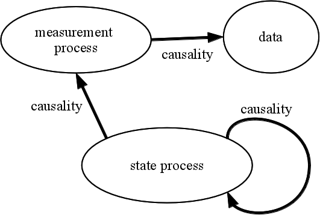

Licensed under the [Creative Commons attribution-noncommercial license](http://creativecommons.org/licenses/by-nc/3.0).
Please share and remix noncommercially, mentioning its origin.  


This document was produced using **pomp** version `r packageVersion("pomp")` and **R** version `r getRversion()`.

```{r knitr-opts,include=FALSE,purl=FALSE}
library(knitr)
prefix <- "getting-started"
opts_chunk$set(
  progress=TRUE,
  prompt=FALSE,tidy=FALSE,highlight=TRUE,
  strip.white=TRUE,
  warning=FALSE,
  message=FALSE,
  error=FALSE,
  echo=TRUE,
  cache=TRUE,
  cache.extra=rand_seed,
  results='markup',
  fig.show='asis',
  size='small',
  fig.lp="fig:",
  fig.path=paste0("figure/",prefix,"-"),
  cache.path=paste0("cache/",prefix,"-"),
  fig.pos="h!",
  fig.align='center',
  fig.height=4,fig.width=6.83,
  dpi=300,
  dev='png',
  dev.args=list(bg='transparent')
  )
```

```{r parallel,include=FALSE,cache=FALSE}
library(foreach)
library(doMPI)
cl <- startMPIcluster()
registerDoMPI(cl)
```
```{r prelims,echo=FALSE,cache=FALSE}
library(pomp)
stopifnot(packageVersion("pomp")>="1.6")
options(
  keep.source=TRUE,
  stringsAsFactors=FALSE,
  encoding="UTF-8",
  scipen=5
  )
set.seed(594709947L)
```
```{r prelims2,echo=FALSE,cache=FALSE}
library(ggplot2)
library(plyr)
library(reshape2)
library(magrittr)
theme_set(theme_bw())
```

## Introduction

This tutorial aims to help you get started using **pomp** as a suite of tools for analysis of time series data based on dynamical systems models.
First, we give some conceptual background regarding the class of models---partially observed Markov processes---that **pomp** handles.
We then discuss some preliminaries: installing the package and so on.
Next, using a basic question about ecological population regulation as an example, we load some data and implement some models as `R` objects of class `pomp`.
Finally, we illustrate some of the package's capabilities by using its algorithms to fit and compare the models using various inference methods.


## Partially observed Markov process (POMP) models

As its name implies **pomp** is focused on partially observed Markov process models.
These are also known as state-space model, hidden Markov models, and stochastic dynamical systems models.
Such models consist of an unobserved stochastic *state process*, connected to the data via an explicit model of the observation process.
We refer to the former as the *process model* and the latter as the *measurement model*.
Each model is, in fact, a probability distribution.
Suppose we have a sequence of measurements, $y^*_{n}$, made at times $t_n$, $n=1,\dots,N$.
Let $Y_n$ denote the measurement process and $X_n$ the state process, then by definition, the process model is determined by the density $f_{X_n|X_{n-1}}$ and the initial density $f_{X_0}$.
The measurement process is determined by the density $f_{Y_n|X_n}$.
We think of the data, $y^*_n$, as being a single realization of the $Y$ process.
To implement a POMP model in **pomp**, we have to specify the measurement and process distributions.

Note however, that, for each of the process and the measurement model there are two distinct operations that we might wish to perform:

1. we might wish to *simulate*, i.e., to draw a (pseudo)random sample from the distribution, or
2. we might wish to *evaluate the density* itself at given values of $X_n$ and/or $Y_n$.

Following the **R** convention, we refer to the simulation of $f_{X_n|X_{n-1}}$ as the *rprocess* component of the POMP model and the evaluation of $f_{X_n|X_{n-1}}$ as the *dprocess* component.
Similarly, the simulation of $f_{Y_n|X_n}$ is the *rmeasure* component while the evaluation of $f_{Y_n|X_n}$ is the *dmeasure* component.
Methods that make no use of the *dprocess* component are called "plug-and-play" methods.
At present, **pomp** is focused on such methods, so there is no reason to discuss the dprocess component further.
In the following, we will illustrate and explain how one specifies the rprocess, rmeasure, and dmeasure components of a model in **pomp**.
We will illustrate this using some simple examples.

-----------------------------------

The following is a schematic of the structure of a POMP showing causal relations between the process model, the measurement model, and the data.
**The key perspective to keep in mind is that the model is to be viewed as the process that generated the data.**



-----------------------------------

Here is another POMP model schematic, showing dependence among model variables.

```{r ssdiag2,echo=FALSE,purl=FALSE,fig.height=3,fig.width=6}
library(grid)
vp <- viewport(x=unit(0.5,"npc"),y=unit(0.54,"npc"),
               width=unit(0.96,"npc"),height=unit(0.96,"npc"))
pushViewport(vp)

fs <- 12
x1 <- 0.6; y1 <- 0.88
gp <- gpar(lty=2,col=grey(0.6),fontsize=12)
grid.text(x=x1,y=y1,label="measurement model",just="centre",gp=gpar(fontsize=fs,col=grey(0.6)))
grid.lines(x=unit(c(x1,3/12),"npc")+unit(c(0,2),"points"),y=unit(c(y1,1/2),"npc")+unit(c(-fs/2,0),"points"),gp=gp)
grid.lines(x=unit(c(x1,6/12),"npc")+unit(c(0,2),"points"),y=unit(c(y1,1/2),"npc")+unit(c(-fs/2,0),"points"),gp=gp)
grid.lines(x=unit(c(x1,8/12),"npc")+unit(c(0,-2),"points"),y=unit(c(y1,1/2),"npc")+unit(c(-fs/2,0),"points"),gp=gp)
grid.lines(x=unit(c(x1,10/12),"npc")+unit(c(0,-2),"points"),y=unit(c(y1,1/2),"npc")+unit(c(-fs/2,0),"points"),gp=gp)

x1 <- 0.4; y1 <- 0.14
grid.text(x=x1,y=y1,label="process model",just="centre",gp=gp)
grid.lines(x=unit(c(x1,4/24),"npc"),y=unit(c(y1,1/3),"npc")+unit(c(fs/2,-fs/4),"points"),gp=gp)
grid.lines(x=unit(c(x1,23/72),"npc"),y=unit(c(y1,1/3),"npc")+unit(c(fs/2,-fs/4),"points"),gp=gp)
grid.lines(x=unit(c(x1,31/72),"npc"),y=unit(c(y1,1/3),"npc")+unit(c(fs/2,-fs/4),"points"),gp=gp)
grid.lines(x=unit(c(x1,14/24),"npc"),y=unit(c(y1,1/3),"npc")+unit(c(fs/2,-fs/4),"points"),gp=gp)
grid.lines(x=unit(c(x1,18/24),"npc"),y=unit(c(y1,1/3),"npc")+unit(c(fs/2,-fs/4),"points"),gp=gp)
grid.lines(x=unit(c(x1,65/72),"npc"),y=unit(c(y1,1/3),"npc")+unit(c(fs/2,-fs/4),"points"),gp=gp)

grid.text(x=1/72,y=c(1/3,2/3),label=c("states","observations"),just="centre",rot=90,gp=gp)

x1 <- unit(c(1,3,6,8,10,3,6,8,10)/12,"npc")
y1 <- unit(c(rep(1,5),rep(2,4))/3,"npc")
w <- unit(1/12,"npc")
h <- unit(1/6,"npc")

grid.lines(x=c(1/48,47/48),y=1/12,arrow=arrow(length=unit(0.02,"npc")))
grid.text(x=x1[1:5],y=1/24,label=c(expression(italic(t[0])),expression(italic(t[1])),expression(italic(t[n-1])),expression(italic(t[n])),expression(italic(t[n+1]))))

grid.rect(x=x1,y=y1,width=w,height=h,just=c(0.5,0.5),gp=gpar(fill="white",lwd=2))
grid.text(x=x1,y=y1,label=c(
  expression(italic(X[0])),expression(italic(X[1])),
  expression(italic(X[n-1])),expression(italic(X[n])),
  expression(italic(X[n+1])),
  expression(italic(Y[1])),expression(italic(Y[n-1])),
  expression(italic(Y[n])),expression(italic(Y[n+1]))),
  gp=gpar(fontface=3))
grid.text(x=c(4.5,11.5)/12,y=unit(1/3,"npc")+unit(2,"point"),label=quote(phantom(0)~cdots~phantom(0)),gp=gpar(fontsize=15))
grid.lines(x=c(1,3)/12+c(1,-1)/24,y=1/3,arrow=arrow(length=unit(0.02,"npc")),gp=gpar(lwd=2))
grid.lines(x=c(3,4)/12+c(1,1/3)/24,y=1/3,arrow=arrow(length=unit(0.02,"npc")),gp=gpar(lwd=2))
grid.lines(x=c(5,6)/12+c(-1/3,-1)/24,y=1/3,arrow=arrow(length=unit(0.02,"npc")),gp=gpar(lwd=2))
grid.lines(x=c(6,8)/12+c(1,-1)/24,y=1/3,arrow=arrow(length=unit(0.02,"npc")),gp=gpar(lwd=2))
grid.lines(x=c(8,10)/12+c(1,-1)/24,y=1/3,arrow=arrow(length=unit(0.02,"npc")),gp=gpar(lwd=2))
grid.lines(x=c(10,11)/12+c(1,1/3)/24,y=1/3,arrow=arrow(length=unit(0.02,"npc")),gp=gpar(lwd=2))
grid.lines(x=3/12,y=c(1,2)/3+c(1,-1)/12,arrow=arrow(length=unit(0.02,"npc")),gp=gpar(lwd=2))
grid.lines(x=6/12,y=c(1,2)/3+c(1,-1)/12,arrow=arrow(length=unit(0.02,"npc")),gp=gpar(lwd=2))
grid.lines(x=8/12,y=c(1,2)/3+c(1,-1)/12,arrow=arrow(length=unit(0.02,"npc")),gp=gpar(lwd=2))
grid.lines(x=10/12,y=c(1,2)/3+c(1,-1)/12,arrow=arrow(length=unit(0.02,"npc")),gp=gpar(lwd=2))

popViewport()
```

The state process, $X_n$, is Markovian, i.e.,
$$\mathrm{Prob}[X_n|X_0,\dots,X_{n-1},Y_1,\dots,Y_{n-1}]=\mathrm{Prob}[X_n|X_{n-1}].$$
Moreover, the measurements, $Y_n$, depend only on the state at that time:
$$\mathrm{Prob}[Y_n|X_0,\dots,X_{n},Y_1,\dots,Y_{n-1}]=\mathrm{Prob}[Y_n|X_{n}],$$
for all $n=1,\dots,N$.

-----------------------------------

## Preliminaries

### Installing the package

To get started, we must install **pomp**, if it is not already installed.
The package can be downloaded from CRAN, but the latest version is always available at the package homepage on Github.
See the [package website for installation instructions](http://kingaa.github.io/pomp/install.html).

### Important information for Windows and Mac users.

In this document, we will implement **pomp** models using the package's `Csnippet` facility.
This allows the user to write model components using snippets of C code, which is then compiled and linked into a running `R` session.
This typically affords a manyfold increase in computation time.
It is possible to avoid `Csnippet`s entirely by writing model components as `R` functions, but the resulting implementations are typically too slow to be of practical use.
To use `Csnippet`s, you must be able to compile C codes.
Compilers are not by default installed on Windows or Mac systems, so users of such systems must do a bit more work to make use of **pomp**'s facilities.
The [installation instructions on the package website](http://kingaa.github.io/pomp/install.html) give details.


### Loading data

We will illustrate **pomp** by performing a limited data analysis on a set of bird abundance data.
The data are from annual censuses of a population of *Parus major* (Great Tit) in Wytham Wood, Oxfordshire.
They were retrieved as dataset #10163 from the Global Population Dynamics Database version 2 (NERC Centre for Population Biology, Imperial College, 2010).
The original source is @McCleery1991.

We load the data by doing
```{r load-parus-data}
parus.dat <- read.csv(text="
                      year,P
                      1960,148
                      1961,258
                      1962,185
                      1963,170
                      1964,267
                      1965,239
                      1966,196
                      1967,132
                      1968,167
                      1969,186
                      1970,128
                      1971,227
                      1972,174
                      1973,177
                      1974,137
                      1975,172
                      1976,119
                      1977,226
                      1978,166
                      1979,161
                      1980,199
                      1981,306
                      1982,206
                      1983,350
                      1984,214
                      1985,175
                      1986,211"
                      )
```

Here is a plot of these data:

```{r parus-plot}
ggplot(data=parus.dat,mapping=aes(x=year,y=P))+
  geom_line()+geom_point()+
  expand_limits(y=0)+
  theme_bw()
```

## Specifying a continuous-time process model

To keep things simple, let's attempt to explain these data using a very simple model of stable but stochastic population dynamics, the logistic, or Verhulst-Pearl, equation with environmental stochasticity.
We'll write this model as a stochastic differential equation (SDE), specifically an Ito diffusion:
$$dN = r\,N\,\left(1-\frac{N}{K}\right)\,dt+\sigma\,N\,dW(t),$$
where $N$ is the population size, $r$ is a fixed rate, the so-called "Malthusian parameter", $K$ is the population's "carrying capacity", $\sigma$ describes the intensity of extrinsic stochastic forcing on the system, and $dW$ is an increment of a standard Wiener process.
[Those unfamiliar with Wiener processes and Ito diffusions will find it useful to visualize $dW(t)$, for each time $t$, as a normal random variable with mean zero and standard deviation $\sqrt{dt}$.]
To implement this model in **pomp**, we must tell the package how to simulate this model.
The easiest way to simulate such an SDE is via the *Euler-Maruyama* method.
In this approximation, we take a large number of very small steps, each of duration $\Delta t$.
At each step, we hold the right-hand side of the above equation constant, compute $\Delta N$ using that equation, and increment $N$ accordingly.
**pomp** gives us the `euler.sim` function to assist us in implementing the Euler-Maruyama method.
To use it, we must encode the computations that take a single step.
The best way to do this is to write a snippet of code in the C language.
The following is such a snippet for the stochastic logistic equation above.

```{r logistic-step-fun}
step.fun <- Csnippet("
  double dW = rnorm(0,sqrt(dt));
  N += r*N*(1-N/K)*dt+sigma*N*dW;
")
```

This is just a snippet of C code: not all the variables are declared and the context of the snippet is not specified.
When given this snippet, `pomp` will provide the necessary declarations and context, compile the resulting C code, dynamically link to it, and use it to simulate realizations of the process model.
We cause all this to happen when we construct an object of class `pomp` via a call to the constructor function, which is also named `pomp`:

```{r logistic-pomp1}
parus <- pomp(data=parus.dat,time="year",t0=1959,
              rprocess=euler.sim(step.fun=step.fun,delta.t=1/365),
              statenames="N",paramnames=c("r","K","sigma"))
```

In the above, we've specified an Euler-Maruyama time-step of about one day.
The `t0` argument specifies that we are going to treat the stochastic state process as being initialized in year 1959.
We use the `statenames` and `paramnames` arguments to indicate which of the undeclared variables in the `Csnippet` `step.fun` are state variables and which are fixed parameters.
Since `dW` is a local variable, we must provide an ordinary C declaration for it.
Note that `dt` is a variable that is defined in the context of this snippet; it is actually provided by `pomp` and will contain the size of the Euler step.
The `rnorm` function is part of the [`R` API](http://cran.r-project.org/doc/manuals/r-release/R-exts.html#The-R-API): see the [manual on "Writing R Extensions"](http://cran.r-project.org/doc/manuals/r-release/R-exts.html) for a description of this and the other [distribution functions provided as part of the `R` API](http://cran.r-project.org/doc/manuals/r-release/R-exts.html#Distribution-functions).
Finally, note that the state variable `N` is over-written by this snippet: it's value when the first line is executed is overwritten by the second line.

A full set of rules for writing **pomp** C snippets is given in the package help `?Csnippet`.

With the process model in place, we can simulate the process model using the `simulate` function and plot several realizations for a given set of parameters.

```{r logistic-simul1}
simStates <- simulate(parus,nsim=10,params=c(r=0.2,K=200,sigma=0.5,N.0=200),states=TRUE)
```
```{r logistic-plot1,echo=FALSE}
melt(simStates) %>% 
  dcast(rep+time~variable) %>%
  ggplot(mapping=aes(x=time,y=N,group=rep,color=factor(rep)))+
  geom_line()+guides(color=FALSE)+
  theme_bw()
```


## Specifying the measurement model

Although it is the process model that is usually the focus of an investigator's interest, the measurement model is equally important because it connects the process model to the data.
For this example, let's model the observations using a Poisson distribution:
$$P_t \sim \mathrm{Poisson}(N_t),$$
where, at time $t$, $P_t$ is our census count and $N_t$ is the true population size.

### The rmeasure component

The following snippet encodes the rmeasure component for this model.
```{r logistic-rmeasure}
rmeas <- Csnippet("
  P = rpois(N);
")
```
In this snippet of code, `N` is the state variable and `P` is the name of our observable, as defined in the dataset `parus.dat`.
The `rpois` function is part of the [`R` API](http://cran.r-project.org/doc/manuals/r-release/R-exts.html#The-R-API): it takes a single argument---the Poisson distribution's parameter---and returns a pseudo-random draw from the Poisson distribution with that parameter.
As with the `step.fun` snippet above, execution of this snippet causes `P` to be overwritten.

To fold this into our `pomp` object, we do
```{r logistic-pomp2}
parus <- pomp(parus,rmeasure=rmeas,statenames="N")
```
Note that, again, we must tell `pomp` which of the variables (if any) is a parameter and which is a state variable.
We can now simulate from the full POMP model and plot the results.
```{r logistic-simul2}
sim <- simulate(parus,params=c(r=0.2,K=200,sigma=0.5,N.0=200),
                nsim=10,obs=TRUE,states=TRUE)
```
```{r logistic-plot2,echo=FALSE}
sim %>% melt() %>% 
  ggplot(mapping=aes(x=time,y=value,group=rep,color=factor(rep)))+
  geom_line()+
  guides(color=FALSE)+scale_y_sqrt()+
  facet_grid(variable~.,scales="free_y")

sim %>% melt() %>% dcast(rep+time~variable,value.var='value') %>%
  ggplot(mapping=aes(x=N,y=P,color=factor(rep)))+
  geom_point()+scale_x_sqrt()+scale_y_sqrt()+
  coord_equal()+
  guides(color=FALSE)
```

### The dmeasure component

The following snippet encodes the dmeasure component.
```{r logistic-dmeasure}
dmeas <- Csnippet("
  lik = dpois(P,N,give_log);
")
```
and we fold it into the `pomp` object via
```{r logistic-pomp3}
parus <- pomp(parus,dmeasure=dmeas,statenames="N")
```

In the `dmeas` snippet, `dpois` again comes from the [`R` API](http://cran.r-project.org/doc/manuals/r-release/R-exts.html#The-R-API).
It takes three arguments, the datum, the Poisson parameter, and `give_log`.
When `give_log=0`, `dpois` returns the Poisson likelihood; 
when `give_log=1`, `dpois` returns the log of this likelihood.
When this snippet is executed, `pomp` will provide the value of `give_log` according to its needs.
It is the user's responsibility to make sure that the correct value is returned.

Since we now have both the rprocess and the dmeasure components in place, we can perform a particle filtering operation to estimate the log likelihood at any given point in parameter space.
For example, we can do
```{r logistic-pfilter}
pf <- pfilter(parus,Np=1000,params=c(r=0.2,K=200,sigma=0.5,N.0=200))
logLik(pf)
```

## A continuous-time deterministic skeleton

A deterministic skeleton of the logistic model is obtained by taking $\sigma\to 0$, which leads to the deterministic differential equation
$$\frac{dN}{dt} = r\,N\,\left(1-\frac{N}{K}\right).$$
The following snippet encodes this deterministic skeleton and folds it into the `pomp` object.
```{r logistic-skeleton}
skel <- Csnippet("
  DN = r*N*(1-N/K);
")

parus <- pomp(parus,skeleton=vectorfield(skel),statenames="N",paramnames=c("r","K"))
```
Note that in this snippet, `DN` is filled with the value of the time-derivative of `N`. 
See the package help (`?Csnippet`) for a complete set of rules for writing C snippets.

With the deterministic skeleton in place we can generate several trajectories of the skeleton using `trajectory`, as follows, and plot the result.
```{r logistic-traj1}
pars <- parmat(c(r=1,K=200,sigma=0.5,N.0=20),5)
pars["N.0",] <- seq(20,300,length=5)
traj <- trajectory(parus,params=pars,times=seq(1959,1970,by=0.01))
```
```{r logistic-plot3,echo=FALSE}
trajectory(parus,params=pars,times=seq(1959,1970,by=0.01),as.data.frame=TRUE) %>%
  ggplot(mapping=aes(x=time,y=N,group=traj,color=traj))+
  guides(color=FALSE)+
  geom_line()
```

## Specifying a discrete-time process model and skeleton

Let us demonstrate the implementation of discrete-time process models by replacing the continuous-time logistic equation used above with the stochastic Beverton-Holt model
$$N_{t+1}=\frac{a\,N_t}{1+b\,N_t}\,\varepsilon_t,$$
where $a$ and $b$ are parameters and $\varepsilon_t\sim\mathrm{Lognormal}(-\tfrac{1}{2}\sigma^2,\sigma)$.

Since we are now dealing with a discrete-time model, `euler.sim` will no longer construct an appropriate rprocess component.
Instead, we can use `discrete.time.sim`, which also takes a C snippet encoding the one-step simulation.
The following snippet simulates a single iteration of the stochastic Beverton-Holt map
```{r bh-stepfun}
bh.step <- Csnippet("
  double eps = rlnorm(-sigma*sigma/2,sigma);
  N = a*N/(1+b*N)*eps;
")
```
A corresponding skeleton is the deterministic Beverton-Holt map obtained by setting $e_t=1$ in the above equation.
A snippet that implements this map is
```{r bh-skeleton}
bh.skel <- Csnippet("
  DN = a*N/(1+b*N);
")
```
Note that, as in the continuous case, we indicate the new value of the state variable by prepending `D` to the variable name.

We create a new `pomp` object based on this process model but with the same rmeasure and dmeasure components as in `parus` by executing
```{r bh-pomp1}
parus.bh <- pomp(parus,rprocess=discrete.time.sim(bh.step,delta.t=1),skeleton=map(bh.skel,delta.t=1),statenames="N",paramnames=c("a","b","sigma"))
```
The following codes test the above by computing some simulations, a trajectory of the skeleton, and running a particle filtering operation.
```{r bh-test}
coef(parus.bh) <- c(a=1.1,b=5e-4,sigma=0.5,N.0=30)
sim <- simulate(parus.bh)
traj <- trajectory(parus.bh)
pf <- pfilter(parus.bh,Np=1000)
```

## Parameter transformations

We can specify model-specific parameter transformations using C snippets.
The following implements log transformation of the $r$ and $K$ parameters of the logistic model and folds them into the `pomp` object `parus`.
```{r logistic-partrans}
logtrans <- Csnippet("
  Tr = log(r);
  TK = log(K);
  Tsigma = log(sigma);
")

exptrans <- Csnippet("
  Tr = exp(r);
  TK = exp(K);
  Tsigma = exp(sigma);
")

parus <- pomp(parus,toEstimationScale=logtrans,
              fromEstimationScale=exptrans,
              paramnames=c("r","K","sigma"))
```
```{r logistic-partrans-test,include=FALSE}
p <- c(r=1,K=200,N.0=200,sigma=0.5)
coef(parus,transform=TRUE) <- partrans(parus,p,dir="inv")
stopifnot(all.equal(p,coef(parus)))
```

## Trajectory matching

Trajectory matching is the method of fitting a deterministic model to data assuming independent errors.
In **pomp**, the function `traj.match` searches parameter space to find parameters under which the likelihood of the data, given a trajectory of the deterministic skeleton, is maximized.

```{r parus-traj-match}
tm <- traj.match(parus,start=c(r=1,K=200,N.0=200,sigma=0.5),
                 est=c("r","K"),transform=TRUE)
signif(coef(tm),3)
logLik(tm)
```

We can simulate the fitted model and compare it against the data.
```{r parus-tm-sim1}
coef(tm,"sigma") <- 0
simulate(tm,nsim=10,as.data.frame=TRUE,include.data=TRUE) %>%
  ggplot(aes(x=time,y=P,group=sim,alpha=(sim=="data")))+
  scale_alpha_manual(name="",values=c(`TRUE`=1,`FALSE`=0.2),
                     labels=c(`FALSE`="simulation",`TRUE`="data"))+
  geom_line()
```

## Maximizing the likelihood by iterated filtering

Iterated filtering [@Ionides2015; @Ionides2006] is a method for maximizing the likelihood by repeatedly applying a particle filter.  
The following codes apply the IF2 algorithm [@Ionides2015].
```{r parus-mif,purl=FALSE,eval=FALSE}
guesses <- sobolDesign(lower=c(r=0,K=100,sigma=0,N.0=200),
                       upper=c(r=5,K=600,sigma=2,N.0=200),
                       nseq=100)
foreach (guess=iter(guesses,"row"),.combine=rbind,
         .options.mpi=list(seed=334065675),
         .packages=c("pomp","magrittr"),.errorhandling="remove") %dopar% {
             parus %>% 
                 mif2(start=unlist(guess),Nmif=50,Np=1000,transform=TRUE,
                      cooling.fraction.50=0.8,cooling.type="geometric",
                      rw.sd=rw.sd(r=0.02,K=0.02,sigma=0.02)) %>%
                 mif2() -> mf
             ll <- logmeanexp(replicate(5,logLik(pfilter(mf))),se=TRUE)
             data.frame(loglik=ll[1],loglik.se=ll[2],as.list(coef(mf)))
         } -> mles
```
```{r parus-mif-eval,include=FALSE,eval=TRUE,purl=TRUE}
bake(file="parus-mif.rds",{
    <<parus-mif>>
}) -> mles
```
In the above, we first use `sobolDesign` to construct a Latin hypercube design for the "starting points", i.e., the points in parameter space where we will begin our searches for the MLE.
At each of these (`foreach`), we first run 50 iterations of the IF2 algorithm (`mif2`).
We then re-run the algorithm, starting from where the first run ended up (the second `mif2`).
To obtain an estimate of the log likelihood at that (putative) MLE, we run 5 independent particle filtering operations (`pfilter`), averaging the likelihoods with proper attention paid to Jensen's inequality (`logmeanexp`).
This gives us both an unbiased estimate of the log likelihood at that point and an estimate of the Monte Carlo error in that estimate.
A useful way of displaying the results of such multi-start search is the pairwise scatterplot matrix:
```{r plot-mles}
pairs(~loglik+r+K+sigma,data=mles)
```

We can improve the quality of our estimates and obtain likelihood-ratio-test based confidence intervals by constructing *profile likelihoods*.
In a likelihood profile, one varies the focal parameter (or subset of parameters) across some range, maximizing the likelihood at each value of the focal parameter over the remaining parameters.
The following codes construct a likelihood profile over $r$.
```{r parus-profile1}
profileDesign(
  r=seq(from=0.1,to=5,length=21),
  lower=c(K=100,sigma=0.01,N.0=200),upper=c(K=600,sigma=0.2,N.0=200),
  nprof=50
) -> pd
dim(pd)
pairs(~r+K+sigma+N.0,data=pd)
```
```{r parus-profile2,eval=FALSE,purl=FALSE}
foreach (p=iter(pd,"row"),
         .combine=rbind,
         .errorhandling="remove",
         .packages=c("pomp","magrittr","reshape2","plyr"),
         .inorder=FALSE,
         .options.mpi=list(seed=1680158025)
         ) %dopar%
    {
        parus %>% 
            mif2(start=unlist(p),Nmif=50,Np=1000,transform=TRUE,
                 cooling.fraction.50=0.8,cooling.type="geometric",
                 rw.sd=rw.sd(K=0.02,sigma=0.02)) %>%
            mif2() -> mf
        
        pf <- replicate(5,pfilter(mf,Np=1000))  ## independent particle filters
        ll <- sapply(pf,logLik)
        ll <- logmeanexp(ll,se=TRUE)
        nfail <- sapply(pf,getElement,"nfail")  ## number of filtering failures
        
        data.frame(as.list(coef(mf)),
                   loglik = ll[1],
                   loglik.se = ll[2],
                   nfail.min = min(nfail),
                   nfail.max = max(nfail))
    } %>% arrange(r,-loglik) -> r_prof
```
```{r parus-profile-eval,include=FALSE,purl=TRUE,eval=TRUE}
bake("parus-profile.rds",{
    <<parus-profile2>>
}) -> r_prof
```

```{r parus-profile-plot}
pairs(~loglik+r+K+sigma,data=r_prof,subset=loglik>max(loglik)-10)
r_prof %>% 
  mutate(r=signif(r,8)) %>%
  ddply(~r,subset,loglik==max(loglik)) %>%
  ggplot(aes(x=r,y=loglik))+geom_point()+geom_smooth()
```

Now let us plot the data and 10 simulated realizations of the model process are plotted on the same axes.
```{r plot-mle-sims}
r_prof %>% 
  subset(loglik==max(loglik)) %>% unlist() -> mle
simulate(parus,params=mle,nsim=10,as.data.frame=TRUE,include.data=TRUE) %>%
  ggplot(mapping=aes(x=time,y=P,group=sim,alpha=(sim=="data")))+
  scale_alpha_manual(name="",values=c(`TRUE`=1,`FALSE`=0.2),
                     labels=c(`FALSE`="simulation",`TRUE`="data"))+
  geom_line()
```

## Sampling the posterior using particle Markov chain Monte Carlo

If we seek to do full-information Bayesian inference, we can use particle Markov chain Monte Carlo, implemented in **pomp** in the `pmcmc` function.
First, we add a prior to the `pomp` object by furnishing a prior probability density evaluation function (`dprior`).
```{r parus-dprior}
parus %<>%
  pomp(dprior=Csnippet("
    lik = dunif(r,0,5,1)+dunif(K,100,600,1)+dunif(sigma,0,2,1);
    lik = (give_log) ? lik : exp(lik);
  "),paramnames=c("r","K","sigma"))
```
The following codes cause parallel pMCMC chains to be run, each beginning at one of the estimates obtained using `mif2`.
```{r parus-pmcmc,eval=FALSE,purl=FALSE}
r_prof %>% ddply(~r,subset,loglik==max(loglik)) %>%
    subset(K > 100 & K < 600 & r < 5 & sigma < 2,
           select=-c(loglik,loglik.se)) -> starts
foreach (start=iter(starts,"row"),.combine=c,
         .options.mpi=list(seed=23781975),
         .packages=c("pomp","magrittr"),.errorhandling="remove") %dopar% 
    {
        parus %>%
            pmcmc(Nmcmc=2000,Np=200,start=unlist(start),
                  proposal=mvn.rw.adaptive(rw.sd=c(r=0.1,K=100,sigma=0.1),
                                           scale.start=100,shape.start=100)) -> chain
        chain %>% pmcmc(Nmcmc=10000,proposal=mvn.rw(covmat(chain)))
    } -> chains
```
```{r parus-pmcmc-eval,eval=TRUE,purl=TRUE,include=FALSE}
bake(file="parus-pmcmc.rds",{
    <<parus-pmcmc>>
}) -> chains
```

In the above, we first subset out those `mif2` estimates that are consistent with our prior.
At each of these, we then perform a number of MCMC moves, using an adaptive multivariate-normal random-walk proposal distribution `mvn.rw.adaptive`.
To complete the inference, we do `r nrow(chains[[1]])` more MCMC iterations using a multivariate random-walk proposal (`mvn.rw`) with covariance matrix derived from the preceding computation (`covmat`).

Now we investigate the chains, to try and determine whether they have converged.

```{r pmcmc-diagnostics}
library(coda)
chains %>% conv.rec() -> traces
rejectionRate(traces[,c("r","K","sigma")])
autocorr.diag(traces[,c("r","K","sigma")])
traces <- window(traces,thin=50,start=1000)
plot(traces[,"r"])
plot(traces[,"K"])
plot(traces[,"sigma"])
gelman.diag(traces[,c("r","K","sigma")])
```

Insofar as we can tell, the MCMC iterations appear to have converged to their stationary distribution.
Let us now examine the posterior distribution.
We will also simulate from the posterior median parameters.
```{r pmcmc-sim}
summary(traces[,c("r","K","sigma")])
theta <- summary(traces)$quantiles[c("r","K","sigma","N.0"),'50%']
simulate(parus,params=theta,nsim=10,as.data.frame=TRUE,include.data=TRUE) %>%
  ggplot(mapping=aes(x=time,y=P,group=sim,alpha=(sim=="data")))+
  scale_alpha_manual(name="",values=c(`TRUE`=1,`FALSE`=0.2),
                     labels=c(`FALSE`="simulation",`TRUE`="data"))+
  geom_line()
```

If we desire an estimate of the smoothed state variables, i.e., the distribution of $N_t\,\vert\,P_{1960},\,\dots,\,P_{1986}$, for $t=1960,\,\dots\,1986$, we can use the `filter.traj` command to extract samples from this distribution.
For example, the following codes extract a single trajectory from each MCMC sample.
After thinning and discarding the burn-in, and assuming that the PMCMC chains above have converged, these are, as @Andrieu2010 showed, samples from the smoothing distribution.
The following codes extract samples of the trajectories of $N$ from the posterior distribution (`filter.traj`), discard the burn-in and thin (`rep > 1000 & rep %% 50 == 0`), and plot the median and equal-tailed 95\% credible interval at each time point.

```{r parus-filter-traj}
chains %>% filter.traj() %>% melt() %>% 
  subset(rep > 1000 & rep %% 50 == 0) %>%
  dcast(L1+rep+time~variable) %>%
  ddply(~time,summarize,
        prob=c(0.025,0.5,0.975),
        q=quantile(N,prob)) %>% 
  mutate(qq=mapvalues(prob,from=c(0.025,0.5,0.975),to=c("lo","med","hi"))) %>%
  dcast(time~qq,value.var='q') %>% 
  ggplot()+
  geom_ribbon(aes(x=time,ymin=lo,ymax=hi),alpha=0.5,fill='blue')+
  geom_line(aes(x=time,y=med),color='blue')+
  geom_point(data=parus.dat,aes(x=year,y=P),color='black',size=2)+
  labs(y="N")
```


## References

```{r,stop-mpi,include=FALSE}
closeCluster(cl)
try(detach("package:doMPI",unload=TRUE),silent=TRUE)
if (exists("mpi.exit")) mpi.exit()
try(detach("package:Rmpi",unload=TRUE),silent=TRUE)
```
