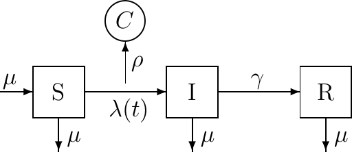
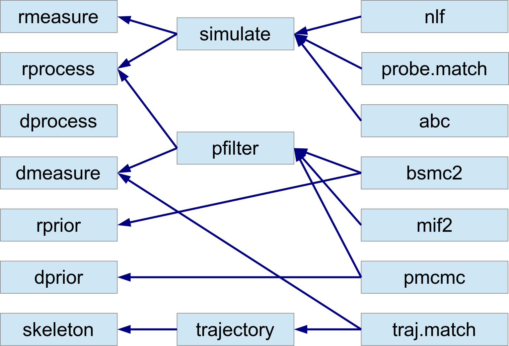

\newcommand\prob[1]{\mathbb{P}\left[{#1}\right]}
\newcommand\expect[1]{\mathbb{E}\left[{#1}\right]}
\newcommand\var[1]{\mathrm{Var}\left[{#1}\right]}
\newcommand\dlta[1]{{\Delta}{#1}}
\newcommand\dist[2]{\mathrm{#1}\left(#2\right)}
\newcommand\cp[2]{N_{{#1}{#2}}}
\newcommand\BirthDeath{\bullet}
\newcommand\lik{\mathcal{L}}
\newcommand\loglik{\ell}
\newcommand\myequals{\hspace{0.5mm}{=}\hspace{0.5mm}}
\newcommand\given{{\,\vert\,}}

[Licensed under the Creative Commons Attribution-NonCommercial license](http://creativecommons.org/licenses/by-nc/4.0/).
Please share and remix noncommercially, mentioning its origin.  


**Note:** This document has been updated for **pomp** version 4.

```{r knitr-opts,include=FALSE,purl=FALSE,cache=FALSE}
source("setup.R", local = knitr::knit_global())
```
```{r opts,include=FALSE,cache=FALSE}
options(stringsAsFactors=FALSE)
library(ggplot2)
theme_set(theme_bw())
set.seed(2028866059L)
```

----------------

## Partially observed Markov process (POMP) models

* Data $y^*_1,\dots,y^*_N$ collected at times $t_1<\dots<t_N$ are modeled as noisy, incomplete, and indirect observations of a Markov process $\{X(t), t\ge t_0\}$.

* This is a __partially observed Markov process (POMP)__ model, also known as a hidden Markov model or a state space model.

* The POMP class of models can accommodate a variety of complexities that commonly arise, especially in biological models:
    - latent variables
    - nonlinear dynamics
    - non-Gaussian distributions
    - continuous-time models (as well as discrete-time models)
    - intractable likelihoods
    - non-differentiable models

--------

## Goals

The  **R**  package **pomp** provides

- facilities for modeling POMPs, 
- a toolbox of statistical inference methods for analyzing data using POMPs, and
- a development platform for implementing new POMP inference methods.

The goals of the **pomp** project are to:

1. facilitate scientific progress by providing high quality, general purpose, reproducible algorithms for statistical inference on POMPs.
1. help separate model issues from method issues to allow one to accurately distinguish model failure from method failure, method improvement from model improvement, etc.
1. provide a test-bed for the development and implementation of new inference algorithms by simplifying the model interface and providing a plethora of benchmarks.
1. exploit potential synergies afforded by hybrid approaches and cross-fertilization of ideas.


Our goal in this presentation is two-fold:

To demonstrate and explain the package...

1. ...from the point of view of the user interested in application of the included methods to a specific data analysis based on a specific set of models.
1. ...from the point of view of a methods developer, who wishes to exploit the package's structure write new methods in such a way that they can be applied to a POMP models generally.


------------------------------


#### Notation for partially observed Markov process models

* Write $X_n=X(t_n)$ and $X_{0:N}=(X_0,\dots,X_N)$. Let $Y_n$ be a random variable modeling the observation at time $t_n$.

* The one-step transition density, $f_{X_n|X_{n-1}}(x_n|x_{n-1};\theta)$, together with the measurement density, $f_{Y_n|X_n}(y_n|x_n;\theta)$ and the initial density, $f_{X_0}(x_0;\theta)$, specify the entire joint density via

$$f_{X_{0:N},Y_{1:N}}(x_{0:N},y_{1:N};\theta) = f_{X_0}(x_0;\theta)\,\prod_{n=1}^N\!f_{X_n | X_{n-1}}(x_n|x_{n-1};\theta)\,f_{Y_n|X_n}(y_n|x_n;\theta).$$

* The marginal density for sequence of measurements, $Y_{1:N}$, evaluated at the data, $y_{1:N}^*$, is

$$f_{Y_{1:N}}(y^*_{1:N};\theta)=\int f_{X_{0:N},Y_{1:N}}(x_{0:N},y^*_{1:N};\theta)\, dx_{0:N}.$$

------------------------------

### A POMP model schematic

- In the following diagram, arrows show direct dependence among model variables:

```{r ssdiag2,echo=FALSE,purl=FALSE,fig.height=3,fig.width=6}
library(grid)
vp <- viewport(x=unit(0.5,"npc"),y=unit(0.54,"npc"),
               width=unit(0.96,"npc"),height=unit(0.96,"npc"))
pushViewport(vp)

fs <- 12
x1 <- 0.6; y1 <- 0.88
gp <- gpar(lty=2,col=grey(0.6),fontsize=12)
grid.text(x=x1,y=y1,label="measurement model",just="centre",gp=gpar(fontsize=fs,col=grey(0.6)))
grid.lines(x=unit(c(x1,3/12),"npc")+unit(c(0,2),"points"),y=unit(c(y1,1/2),"npc")+unit(c(-fs/2,0),"points"),gp=gp)
grid.lines(x=unit(c(x1,6/12),"npc")+unit(c(0,2),"points"),y=unit(c(y1,1/2),"npc")+unit(c(-fs/2,0),"points"),gp=gp)
grid.lines(x=unit(c(x1,8/12),"npc")+unit(c(0,-2),"points"),y=unit(c(y1,1/2),"npc")+unit(c(-fs/2,0),"points"),gp=gp)
grid.lines(x=unit(c(x1,10/12),"npc")+unit(c(0,-2),"points"),y=unit(c(y1,1/2),"npc")+unit(c(-fs/2,0),"points"),gp=gp)

x1 <- 0.4; y1 <- 0.14
grid.text(x=x1,y=y1,label="process model",just="centre",gp=gp)
grid.lines(x=unit(c(x1,4/24),"npc"),y=unit(c(y1,1/3),"npc")+unit(c(fs/2,-fs/4),"points"),gp=gp)
grid.lines(x=unit(c(x1,23/72),"npc"),y=unit(c(y1,1/3),"npc")+unit(c(fs/2,-fs/4),"points"),gp=gp)
grid.lines(x=unit(c(x1,31/72),"npc"),y=unit(c(y1,1/3),"npc")+unit(c(fs/2,-fs/4),"points"),gp=gp)
grid.lines(x=unit(c(x1,14/24),"npc"),y=unit(c(y1,1/3),"npc")+unit(c(fs/2,-fs/4),"points"),gp=gp)
grid.lines(x=unit(c(x1,18/24),"npc"),y=unit(c(y1,1/3),"npc")+unit(c(fs/2,-fs/4),"points"),gp=gp)
grid.lines(x=unit(c(x1,65/72),"npc"),y=unit(c(y1,1/3),"npc")+unit(c(fs/2,-fs/4),"points"),gp=gp)

grid.text(x=1/72,y=c(1/3,2/3),label=c("states","observations"),just="centre",rot=90,gp=gp)

x1 <- unit(c(1,3,6,8,10,3,6,8,10)/12,"npc")
y1 <- unit(c(rep(1,5),rep(2,4))/3,"npc")
w <- unit(1/12,"npc")
h <- unit(1/6,"npc")

grid.lines(x=c(1/48,47/48),y=1/12,arrow=arrow(length=unit(0.02,"npc")))
grid.text(x=x1[1:5],y=1/24,label=c(expression(italic(t[0])),expression(italic(t[1])),expression(italic(t[n-1])),expression(italic(t[n])),expression(italic(t[n+1]))))

grid.rect(x=x1,y=y1,width=w,height=h,just=c(0.5,0.5),gp=gpar(fill="white",lwd=2))
grid.text(x=x1,y=y1,label=c(
  expression(italic(X[0])),expression(italic(X[1])),
  expression(italic(X[n-1])),expression(italic(X[n])),
  expression(italic(X[n+1])),
  expression(italic(Y[1])),expression(italic(Y[n-1])),
  expression(italic(Y[n])),expression(italic(Y[n+1]))),
  gp=gpar(fontface=3))
grid.text(x=c(4.5,11.5)/12,y=unit(1/3,"npc")+unit(2,"point"),label=quote(phantom(0)~cdots~phantom(0)),gp=gpar(fontsize=15))
grid.lines(x=c(1,3)/12+c(1,-1)/24,y=1/3,arrow=arrow(length=unit(0.02,"npc")),gp=gpar(lwd=2))
grid.lines(x=c(3,4)/12+c(1,1/3)/24,y=1/3,arrow=arrow(length=unit(0.02,"npc")),gp=gpar(lwd=2))
grid.lines(x=c(5,6)/12+c(-1/3,-1)/24,y=1/3,arrow=arrow(length=unit(0.02,"npc")),gp=gpar(lwd=2))
grid.lines(x=c(6,8)/12+c(1,-1)/24,y=1/3,arrow=arrow(length=unit(0.02,"npc")),gp=gpar(lwd=2))
grid.lines(x=c(8,10)/12+c(1,-1)/24,y=1/3,arrow=arrow(length=unit(0.02,"npc")),gp=gpar(lwd=2))
grid.lines(x=c(10,11)/12+c(1,1/3)/24,y=1/3,arrow=arrow(length=unit(0.02,"npc")),gp=gpar(lwd=2))
grid.lines(x=3/12,y=c(1,2)/3+c(1,-1)/12,arrow=arrow(length=unit(0.02,"npc")),gp=gpar(lwd=2))
grid.lines(x=6/12,y=c(1,2)/3+c(1,-1)/12,arrow=arrow(length=unit(0.02,"npc")),gp=gpar(lwd=2))
grid.lines(x=8/12,y=c(1,2)/3+c(1,-1)/12,arrow=arrow(length=unit(0.02,"npc")),gp=gpar(lwd=2))
grid.lines(x=10/12,y=c(1,2)/3+c(1,-1)/12,arrow=arrow(length=unit(0.02,"npc")),gp=gpar(lwd=2))

popViewport()
```

- The state process, $X_n$, is Markovian, i.e.,

$$f_{X_n|X_{0:n-1},Y_{1:n-1}}(x_n|x_{0:n-1},y_{1:n-1})=f_{X_n|X_{n-1}}(x_n|x_{n-1}).$$

- Moreover, the measurable random variable, $Y_n$, depends only on the state at that time:
$$f_{Y_n|X_{0:N},Y_{1:n-1}}(y_n|x_{0:n},y_{1:n-1})=f_{Y_n|X_{n}}(y_n|x_n),$$
for all $n=1,\dots,N$.

- Observations times $t_n$ need not be regularly spaced.

----------------


### POMP models viewed algorithmically

To think algorithmically, we define some function calls:

* `rprocess( )`: a draw from $f_{X_n|X_{n-1}}(x_n| x_{n-1};\theta)$

* `dprocess( )`: evaluation of $f_{X_n|X_{n-1}}(x_n| x_{n-1};\theta)$

* `rmeasure( )`: a draw from $f_{Y_n|X_n}(y_n| x_n;\theta)$

* `dmeasure( )`: evaluation of $f_{Y_n|X_n}(y_n| x_n;\theta)$

* `initializer( )`: a draw from $f_{X_0}(x_0;\theta)$

-------------


#### The **pomp** package for POMP models

* **pomp** is an  **R**  package for data analysis using partially observed Markov process (POMP) models.

* Note the distinction: lower case **pomp** is a software package; 
upper case POMP is a class of models.

* **pomp** builds methodology for POMP models in terms of arbitrary user-specified `rprocess()`, `dprocess()`, `rmeasure()`, `dmeasure()`, and `initializer` functions.
 
------------

#### What does it mean for methodology to be __simulation-based__?

* Simulating random processes is often much easier than evaluating their transition probabilities.

* In other words, having formulated a scientifically interesting model, we frequently find ourselves able to write `rprocess()` but not `dprocess()`.

*  __Simulation-based__ methods require the user to specify `rprocess()` but not `dprocess()`.

* __Plug-and-play__, __likelihood-free__ and __equation-free__ are alternative terms for "simulation-based" methods.

* Much development of simulation-based statistical methodology has occurred in the past decade.

* The algorithms in **pomp** at the present moment are all plug-and-play in this sense. As we will see, there is great scope for inclusion of new general methods within or on top of the package.

------------

#### Algorithms currently implemented in **pomp**

As of v. 1.14.

- classical trajectory matching
- basic particle filtering (AKA sequential importance sampling or sequential Monte Carlo)
- the approximate Bayesian sequential Monte Carlo algorithm of @Liu2001b
- the particle Markov chain Monte Carlo method of @Andrieu2010
- approximate Bayesian computation (ABC) of e.g., @Toni2009a
- the iterated filtering method of @Ionides2006
- the improved iterated filtering method of @Ionides2015
- probe-matching methods [@Kendall1999;@Wood2010]
- the nonlinear forecasting method [@Ellner1998;@Kendall2005]
- the ensemble Kalman filter [@Evensen1994;@Evensen2009]
- the ensemble adjustment Kalman filter of @Anderson2001a
- power-spectrum-matching methods of @Reuman2006.

All of the above are plug-and-play methods.

---------

## Using **pomp**

### A first example: the stochastic Ricker map

#### The unobserved state process

- The @Ricker1954 map describes the stochastic dynamics of a simple population,
$$N_{t+1} = r\,N_{t}\,\exp(-c\,N_{t}+\varepsilon_{t}), \qquad \varepsilon_{t}\;\sim\;\dist{Normal}{0,\sigma},$$
    + $N_t$ is the population density at time $t$.
    + $r$ is a fixed value (a parameter) describing the population's intrinsic capacity to increase in one unit of time.
    + $\sigma$ is the standard deviation of the noise process $\varepsilon$. 
    + The parameter $c$ scales the density-dependent population regulation.
    + The equilibrium population is $N_t=\log(r)/c$.
    
- $N$ is a *state variable*, $r$ and $c$ are *parameters*. $r$ is dimensionless and $c$ has units of inverse density.

- For simplicity, we will fix $c=1$ for the remainder of this document.

- We can view the initial condition, $N_0$ as a special kind of parameter, an *initial-value parameter*.

The Ricker model is perhaps the simplest useful nonlinear population dynamics model.
As such, it allows us to introduce the basic features of the **pomp** package with a minimum amount of distracting complexity.
We will examine a more complex model below.


----------

#### Measurement error

- Let's suppose that the Ricker model is our model for the dynamics of a real population.

- However, we cannot know the exact population density at any time, but only estimate it through sampling.

- Let's model measurement error by assuming the observed measurement, $y_t$, is modeled as a realization of a random variable $Y_t$ that is Poisson with mean $\phi\,N_t$:
$$Y_{t}\;\sim\;\dist{Poisson}{\phi\,N_{t}}$$

- In this equation,

1. $N_t$ models the true population density at time $t$,
2. $Y_t$ models the number of individuals sampled at time $t$,
3. the parameter $\phi$ is proportional to our sampling effort.
4. $Y_t$ is dimensionless, so $\phi N_t$ must also be dimensionless.


To map this model onto the general framework discussed [above](#partially-observed-markov-process-pomp-models), we have
$$\begin{gathered}
X_t = (N_t) \qquad \text{or} \qquad X_t = (N_t, \varepsilon_t), \\
Y_t = Y_t, \qquad \theta = (r, c, \phi, N_0)
\end{gathered}$$


----------

#### Putting the Ricker model into **pomp**.

- The basic data-structure provided by **pomp** is the *object of class* `pomp`, alternatively known as a "pomp object".

- It is a container that holds real or simulated data and a POMP model, possibly together with other information such as model parameters and covariates.

A real **pomp** data analysis begins with constructing one or more `pomp` objects to hold the data and the model or models under consideration.
Here, we'll illustrate this process a dataset of *Parus major* abundance in Wytham Wood, near Oxford [@McCleery1991].

Download and plot the data:
```{r parus-data}
loc <- url("https://kingaa.github.io/pomp/vignettes/parus.csv")
dat <- read.csv(loc)
head(dat)
plot(pop~year,data=dat,type='o')
```


The call to construct a `pomp` object is, naturally enough, `pomp`.
Documentation on this function can be had by doing `?pomp`. 

Now, to construct our `pomp` object:
```{r parus-pomp1}
library(pomp)
parus <- pomp(dat,times="year",t0=1959)
```

The `times` argument specifies that the column of `dat` labelled "year" gives the measurement times;
`t0` is the "zero-time", the time at which the state process will be initialized.
We've set it to one year prior to the beginning of the data.
Plot the new `pomp` object:

```{r parus-plot1}
plot(parus)
```

----------

##### Adding in the process model simulator and initializer

We can add the stochastic Ricker model to `parus` by writing a procedure that simulates one realization of the stochastic process, from an arbitary time $t$ to $t+1$, given arbitrary states and parameters.
We provide this to `pomp` in the form of a *Csnippet*, a little snippet of C code that performs the computation.
The following does this.

```{r parus-sim-defn}
stochStep <- Csnippet("
  N = r*N*exp(-c*N+rnorm(0,sigma));
")

pomp(
  parus,
  rprocess=discrete_time(step.fun=stochStep,delta.t=1),
  rinit=Csnippet("N = N_0;"),
  paramnames=c("r","c","sigma","N_0"),
  statenames=c("N")
) -> parus
```

Note that in the above, we use the`rnorm` function from the [**R** API](https://cran.r-project.org/doc/manuals/r-release/R-exts.html#The-R-API).
In general any C function provided by **R** is available to you.
**pomp** also provides a number of C functions that are documented in the header file, `pomp.h`, that is installed with the package.
See the Csnippet documentation (`?Csnippet`) to read more about how to write them.
Note too that we use `discrete.time.sim` here because the model is a stochastic map.
We specify that the time step of the discrete-time process is `delta.t`, here, 1&nbsp;yr.

At this point, we have what we need to simulate the state process:

```{r ricker-first-sim}
sim <- simulate(parus, params=c(N_0=1,r=12,c=1,sigma=0.5),
                format="data.frame")

plot(N~year,data=sim,type='o')
```

----------

##### Adding in the measurement model and parameters

We complete the specification of the POMP by specifying the measurement model.
To obtain the Poisson measurement model described above, we write two Csnippets.
The first simulates:

```{r parus-rmeas-defn}
rmeas <- Csnippet("pop = rpois(phi*N);")
```

The second computes the likelihood of observing `pop` birds given a true density of `N`:

```{r parus-dmeas-defn}
dmeas <- Csnippet("lik = dpois(pop,phi*N,give_log);")
```

In the above, `rpois` and `dpois` again come from [**R**'s C API](https://cran.r-project.org/doc/manuals/r-release/R-exts.html#The-R-API).
Note the `give_log` argument.
When this code is evaluated, `give_log` will be set to 1 if the log likelihood is desired, and 0 else.

We fold these into the `pomp` object:

```{r parus-add-meas}
pomp(parus,
     rmeasure=rmeas,
     dmeasure=dmeas,
     statenames=c("N"),
     paramnames=c("phi")
) -> parus
```

Now we can simulate the whole POMP.
First, let's add some parameters:

```{r ricker-add-params}
coef(parus) <- c(N_0=1,r=20,c=1,sigma=0.1,phi=200)
```

```{r ricker-second-sim,results='markup',fig.height=6,fig.width=5}
library(ggplot2)

sims <- simulate(parus,nsim=3,format="data.frame",include.data=TRUE)

ggplot(data=sims,
       mapping=aes(x=year,y=pop))+
  geom_line()+
  facet_wrap(~.id,ncol=1,scales="free_y")
```

----------

#### Working with the Ricker model in **pomp**.

Let's see what simple things can be done with a `pomp` object.

We can plot the data by doing
```{r plot-ricker}
plot(parus)
```
We can simulate by doing
```{r sim-ricker1}
x <- simulate(parus)
```
What kind of object have we created with this call to `simulate`?
```{r}
class(x)
plot(x)
```
Why do we see more time series in the simulated `pomp` object?

We can turn a `pomp` object into a data frame:
```{r}
y <- as.data.frame(parus)
head(y)
head(simulate(parus,format="data.frame"))
```

We can also run multiple simulations simultaneously:
```{r}
x <- simulate(parus,nsim=10)
class(x)
sapply(x,class)
x <- simulate(parus,nsim=10,format="data.frame")
head(x)
str(x)
```
Also,
```{r fig.height=8}
library(ggplot2)
x <- simulate(parus,nsim=9,format="data.frame",include.data=TRUE)
ggplot(data=x,aes(x=year,y=pop,group=.id,color=(.id=="data")))+
  geom_line()+guides(color="none")+
  facet_wrap(~.id,ncol=2)
```

Notice that `parus` has parameters associated with it:

```{r coef-ricker}
coef(parus)
```

These are the parameters at which the simulations and deterministic trajectory computations above were done.
We can run these at different parameters:

```{r}
theta <- coef(parus)
theta[c("r","N_0")] <- c(5,3)

x <- simulate(parus,params=theta)

plot(x,var="pop")
```

We can also change the parameters stored inside of `parus`:
```{r}
coef(parus,c("r","N_0","sigma")) <- c(5,1.5,0.1)
coef(parus)
plot(simulate(parus),var=c("pop","N"))
```

We can obtain a Monte Carlo estimate of the likelihood using the particle filter:

```{r ricker-pfilter}
pf <- pfilter(parus,Np=1000)
class(pf)
logLik(pf)

plot(pf,var=c("ess","cond.logLik"))
```

--------------------

### A more complex example: a stochastic, seasonal SIR model

A mainstay of theoretical epidemiology, the SIR model describes the progress of a contagious, immunizing infection through a population of hosts [@Kermack1927;@Anderson1991;@Keeling2009].
The hosts are divided into three classes, according to their status vis-&agrave;-vis the infection.
The susceptible class (S) contains those that have not yet been infected and are thereby still susceptible to it;
the infected class (I) comprises those who are currently infected and, by assumption, infectious;
the removed class (R) includes those who are recovered or quarantined as a result of the infection.
Individuals in R are assumed to be immune against reinfection.
We let $S(t)$, $I(t)$, and $R(t)$ represent the numbers of individuals within the respective classes at time $t$.



- We formulate this model as a continuous-time Markov process.
- The numbers of individuals within each class change through time in whole-number increments as discrete births, deaths, and passages between compartments occur.

- $\cp{A}{B}$ is the stochastic counting process whose value at time $t$ is the number of individuals that have passed from compartment $A$ to compartment $B$ during the interval $[t_0,t)$, where $t_0$ is an arbitrary starting point not later than the first observation.
- $\cp{\BirthDeath}{S}$ is births and $\cp{A}{\BirthDeath}$ is deaths from compartment A.
- *Per capita* birth and death rates, and the rate of transition, $\gamma$, from I to R are constants.
- The S to I transition rate, the so-called *force of infection* is $\lambda(t)=\beta\,I(t)/P$,
where $\beta$ is the transmission rate and $P=S+I+R$ is the population size.
- Assume that birth and death rates are equal and independent of infection status: let $\mu$ denote the common rate.
- A consequence is that the expected population size remains constant.

The continuous-time Markov process is fully specified by the infinitesimal increment probabilities.
Specifically, writing $\dlta{N(t)}=N(t+h)-N(t)$, we have
$$\begin{aligned}
    \prob{\dlta{\cp{\BirthDeath}{S}(t)}\myequals 1 \given S(t), I(t), R(t)} &= \mu\,P(t)\,h+o(h), \\
    \prob{\dlta{\cp{S}{I}(t)}\myequals 1 \given S(t), I(t), R(t)} &= \lambda(t)\,S(t)\,h+o(h), \\
    \prob{\dlta{\cp{I}{R}(t)}\myequals 1 \given S(t), I(t), R(t)} &= \gamma\,I(t)\,h+o(h), \\
    \prob{\dlta{\cp{S}{\BirthDeath}(t)}\myequals 1 \given S(t), I(t), R(t) } &= \mu\,S(t)\,h+o(h), \\
    \prob{\dlta{\cp{I}{\BirthDeath}(t)}\myequals 1\given S(t), I(t), R(t)} &= \mu\,I(t)\,h+o(h), \\
    \prob{\dlta{\cp{R}{\BirthDeath}(t)}\myequals 1 \given S(t), I(t), R(t)} &= \mu\,R(t)\,h+o(h),
  \end{aligned}$$
together with statement that all events of the form
$$\{\dlta{\cp{A}{B}(t)}\,{>}\, 1\} \qquad \text{and} \qquad \{\dlta{\cp{A}{B}(t)}\myequals 1,\dlta{\cp{C}{D}(t)}\myequals 1\}
$$
for $A$, $B$, $C$, $D$ with $(A,B)\neq (C,D)$ have probability $o(h)$.
The counting processes are coupled to the state variables [@Breto2011] via the following identities
$$\begin{aligned}
    \dlta{S}(t) &= \dlta{\cp{\BirthDeath}{S}}(t)-\dlta{\cp{S}{I}}(t)-\dlta{\cp{S}{\BirthDeath}}(t),\\
    \dlta{I}(t) &= \dlta{\cp{S}{I}}(t)-\dlta{\cp{I}{R}}(t)-\dlta{\cp{I}{\BirthDeath}}(t),\\
    \dlta{R}(t) &= \dlta{\cp{I}{R}}(t)-\dlta{\cp{R}{\BirthDeath}}(t).\\
  \end{aligned}$$

It is typically impossible to monitor $S$, $I$, and $R$, directly.
It sometimes happens, however, that public health authorities keep records of *cases*, i.e., individual infections.
The number of cases, $C(t_1,t_2)$, recorded within a given reporting interval $[t_1,t_2)$ might perhaps be modeled by a negative binomial process
$$C(t_1,t_2)\;\sim\;\mathrm{NegBin}(\rho\,\dlta{\cp{S}{I}}(t_1,t_2),\theta),$$
where $\dlta{\cp{S}{I}}(t_1,t_2)$ is the true incidence (the accumulated number of new infections that have occured over the $[t_1,t_2)$ interval), $\rho$ is the *reporting rate*, (the probability that an infection is observed and recorded), $\theta$ is the negative binomial "size" parameter, and the notation is meant to indicate that 
$$\expect{C(t_1,t_2)\given \dlta{\cp{S}{I}}(t_1,t_2)=H}=\rho\,H$$ and 
$$\var{C(t_1,t_2)\given \dlta{\cp{S}{I}}(t_1,t_2)=H}=\rho\,H+\frac{\rho^2\,H^2}{\theta}.$$
The fact that the observed data are linked to an accumulation, as opposed to an instantaneous value, introduces a slight complication, which we discuss below.

----------

#### Implementing the SIR model in **pomp**

As before, we will need to write functions to implement some or all of the SIR model's `rprocess`, `rmeasure`, and `dmeasure` components.
As above, we will write these components using **pomp**'s Csnippets.
Recall that these are snippets of C code that **pomp** automatically assembles, compiles, and dynamically loads into the running **R** session.

To start with, we will write snippets that specify the measurement model (`rmeasure` and `dmeasure`):
```{r sir-measmodel}
rmeas <- "
  cases = rnbinom_mu(theta, rho * H);
"

dmeas <- "
  lik = dnbinom_mu(cases, theta, rho * H, give_log);
"
```

Here, we are using `cases` to refer to the data (number of reported cases) and `H` to refer to the true incidence over the reporting interval.

The negative binomial simulator `rnbinom_mu` and density function `dnbinom_mu` are provided by **R**.

The logical flag `give_log` requests the likelihood when `FALSE`, the log likelihood when `TRUE`.

Notice that, in these snippets, we never declare the variables;
`pomp` will ensure that the state variable (`H`), observable (`cases`), parameters (`theta`, `rho`), and likelihood (`lik`) are defined in the contexts within which these snippets are executed.

For the `rprocess` portion, we could simulate from the continuous-time Markov process exactly [@Gillespie1977a];
the **pomp** function `gillespie.sim` implements this algorithm.
However, for practical purposes, the exact algorithm is often prohibitively slow.

If we are willing to live with an approximate simulation scheme, we can use the so-called "tau-leap" algorithm, one version of which is implemented in **pomp** via the `euler` plug-in.

This algorithm holds the transition rates $\lambda$, $\mu$, $\gamma$ constant over a small interval of time $\dlta{t}$ and simulates the numbers of births, deaths, and transitions that occur over that interval.

It then updates the state variables $S$, $I$, $R$ accordingly, increments the time variable by $\dlta{t}$, recomputes the transition rates, and repeats.

Naturally, as $\dlta{t}\to 0$, this approximation to the true continuous-time process becomes better and better.

The critical feature from the inference point of view, however, is that no relationship needs to be assumed between the Euler simulation interval $\dlta{t}$ and the reporting interval, which itself does not even need to be the same from one observation to the next.

Under the above assumptions, the number of individuals leaving any of the classes by all available routes over a particular time interval is a multinomial process.
For example, if $\dlta{\cp{S}{I}}$ and $\dlta{\cp{S}{\BirthDeath}}$ are the numbers of S individuals acquiring infection and dying, respectively, over the Euler simulation interval $[t,t+\dlta{t})$, then
$$(\dlta{\cp{S}{I}},\dlta{\cp{S}{}},S-\dlta{\cp{S}{I}}-\dlta{\cp{S}{\BirthDeath}})\sim\mathrm{Multinom}\left(S(t);p_{SI},p_{S\BirthDeath},1-p_{SI}-p_{S\BirthDeath}\right),$$
where
$$\begin{aligned}
    p_{SI} &= \frac{\lambda(t)}{\lambda(t)+\mu}\,\left(1-e^{-(\lambda(t)+\mu)\,\dlta{t}}\right),\\
    p_{S\BirthDeath} &= \frac{\mu}{\lambda(t)+\mu}\,\left(1-e^{-(\lambda(t)+\mu)\,\dlta{t}}\right).
  \end{aligned}$$
By way of shorthand, we say that the random variable $(\dlta{\cp{S}{I}},\dlta{\cp{S}{}})$ in \cref{eq:eulermultinomial} has an *Euler-multinomial* distribution.
**pomp** provides convenience functions for such distributions, which arise with some frequency in compartmental models.
Specifically, the functions `reulermultinom` and `deulermultinom` respectively draw random deviates from, and evaluate the probability mass function of, such distributions.
As the help pages relate, `reulermultinom` and `deulermultinom` parameterize the Euler-multinomial distributions by the size ($S(t)$ in \cref{eq:eulermultinomial}), rates ($\lambda(t)$ and $\mu$), and time interval $\dlta{t}$.
Obviously, the Euler-multinomial distributions generalize to an arbitrary number of exit routes.

The help page (`?euler`) informs us that to use `euler`, we need to specify a procedure that advances the states from $t$ to $t+\dlta{t}$.
We do this via a Csnippet:
```{r sir-proc-sim-def}
sir.step <- "
  double rate[6];
  double dN[6];
  double P;
  P = S + I + R;
  rate[0] = mu * P;       // birth
  rate[1] = Beta * I / P; // transmission
  rate[2] = mu;           // death from S
  rate[3] = gamma;        // recovery
  rate[4] = mu;           // death from I
  rate[5] = mu;           // death from R
  dN[0] = rpois(rate[0] * dt);
  reulermultinom(2, S, &rate[1], dt, &dN[1]);
  reulermultinom(2, I, &rate[3], dt, &dN[3]);
  reulermultinom(1, R, &rate[5], dt, &dN[5]);
  S += dN[0] - dN[1] - dN[2];
  I += dN[1] - dN[3] - dN[4];
  R += dN[3] - dN[5];
  H += dN[1];
"
```

As before, **pomp** will ensure that the undeclared state variables and parameters are defined in the context within which the snippet is executed.

Note, however, that in the above we do declare certain local variables.

In particular, the `rate` and `dN` arrays hold the rates and numbers of transition events, respectively.

Note too, that we make use of **pomp**'s C interface to `reulermultinom`, documented in the package help pages (`?reulermultinom`).

The package help system (`?pomp`) includes instructions for, and examples of, the use of Csnippets.

Two significant wrinkles remain to be explained.

First, notice that in `sir.step`, the variable `H` simply accumulates the numbers of new infections: `H` is a counting process that is nondecreasing with time.
In fact, the incidence within an interval $[t_1,t_2)$ is $\dlta{\cp{S}{I}}(t_1,t_2)={H}(t_2)-{H}(t_1)$.
This leads to a technical difficulty with the measurement process, however, in that the data are assumed to be records of new infections occurring within the latest reporting interval, while the process model tracks the accumulated number of new infections since time $t_0$.
We can get around this difficulty by re-setting `H` to zero immediately after each observation.
We cause **pomp** to do this via the `pomp` function's `accumvars` argument, as we will see in a moment.
The section on "accumulator variables" in the `pomp` help page (`?pomp`) discusses this in more detail.

The second wrinkle has to do with the initial conditions, i.e., the states $S(t_0)$, $I(t_0)$, $R(t_0)$.
By default, **pomp** will allow us to specify these initial states arbitrarily.
For the model to be consistent, they should be positive integers that sum to the population size $N$.
We can enforce this constraint by customizing the parameterization of our initial conditions.
We do this by furnishing a custom `initializer` in the call to `pomp`.
Let us construct it now and fill it with simulated data.

```{r sir-pomp-def,eval=T,echo=T,results="hide"}
sir1 <- simulate(
  times = seq(0, 10, by = 1/52),
  t0 = -1/52, 
  dmeasure = Csnippet(dmeas),
  rmeasure = Csnippet(rmeas), 
  rprocess = euler(step.fun = Csnippet(sir.step), delta.t = 1/52/20),
  obsnames="cases",
  statenames = c("S", "I", "R", "H"),
  paramnames = c("gamma", "mu", "theta", "Beta", "popsize",
                 "rho", "S.0", "I.0", "R.0"), 
  accumvars = "H",
  rinit = Csnippet("
    double sum = S_0 + I_0 + R_0;
    S = nearbyint(popsize * S_0 / sum);
    I = nearbyint(popsize * I_0 / sum);
    R = nearbyint(popsize * R_0 / sum);
    H = 0;
    "),
  params = c(popsize = 500000, Beta = 400, gamma = 26,
             mu = 1/50, rho = 0.1, theta = 100, S.0 = 26/400,
             I.0 = 0.002, R.0 = 1),
  seed = 1914679908L) -> sir1
```

Notice that we are assuming here that the data are collected weekly and use an Euler step-size of 1/20wk.
Here, we have assumed an infectious period of 2wk ($1/\gamma=1/26$yr) and a basic reproductive number, $R_0$ of $\beta/(\gamma+\mu)\approx 15$.
We have assumed a host population size of 500,000 and 10% reporting efficiency.
The plot below shows one realization of this process.

```{r fig.height=5,echo=FALSE}
ops <- options(scipen=-10)
plot(sir1,mar=c(0,5,2,0))
options(ops)
```

----------

#### More model complexity: time-dependence, covariates, extra-demographic stochasticity

To illustrate the flexibility afforded by **pomp**'s plug-and-play methods, let us add a bit of real-world complexity to the simple SIR model.
We will modify the model to take four facts into account:

1. For many infections, the contact rate is *seasonal*: $\beta=\beta(t)$ varies in more or less periodic fashion with time.
1. The host population may not be truly closed: *imported infections* arise when infected individuals visit the host population and transmit.
1. The host population does not need to be constant in size.
If we have data, for example, on the numbers of births occurring in the population, we can incorporate this directly into the model.
1. Stochastic fluctuation in the rates $\lambda$, $\mu$, and $\gamma$ can give rise to *extrademographic stochasticity*, i.e., random process variability beyond the purely demographic stochasticity we have included so far.

To incorporate seasonality, we would like to assume a flexible functional form for $\beta(t)$.
Here, we will use a three-coefficient Fourier series:
$$\log{\beta(t)}=b_0+b_1\,\cos{2\pi t}+b_2\sin{2\pi t}.$$

There are a variety of ways to account for imported infections.
Here, we will simply assume that there is some constant number, $\iota$, of infected hosts visiting the population.
Putting this together with the seasonal contact rate results in a force of infection $$\lambda(t)=\beta(t)\,\frac{I(t)+\iota}{P}.$$

To incorporate birth-rate information, let us suppose we have data on the number of births occurring each month in this population and that these data are in the form of a data frame `birthdat` with columns `time` and `births`.

We can incorporate the varying birth rate into our model by passing it as a covariate to the simulation code.

When we pass `birthdat` as the `covar` argument to `pomp`, we cause a look-up table to be created and made available to the simulator.

The package employs linear interpolation to provide a value of each variable in the covariate table at any requisite time:
from the user's perspective, a variable `births` will simply be available for use by the model codes.

```{r birthdat,eval=T,echo=F,results="hide"}
##' Construct some fake birthrate data.
birthdat <- data.frame(time=seq(-1,11,by=1/12))
birthdat$births <- 5e5*bspline.basis(birthdat$time,nbasis=5)%*%c(0.018,0.019,0.021,0.019,0.015)
birthdat$births <- freeze(seed=5853712L,{
  ceiling(rlnorm(n=nrow(birthdat),meanlog=log(birthdat$births),sdlog=0.001))})
```

Finally, we can allow for extrademographic stochasticity by allowing the force of infection to be itself a random variable.
We will accomplish this by assuming a random phase in $\beta$:
$$\lambda(t) = \beta(\Phi(t))\,\frac{I(t)+\iota}{N},$$
where the phase $\Phi$ satisfies the stochastic differential equation 
$$d\Phi=dt+\sigma\,dW_t,$$
where $dW(t)$ is a white noise, specifically an increment of standard Brownian motion.
This model assumption attempts to capture variability in the timing of seasonal changes in transmission rates.
As $\sigma$ varies, it can represent anything from a very mild modulation of the timing of the seasonal progression to much more intense variation.

Let us modify the process-model simulator to incorporate these complexities.
```{r complex-sir-def,echo=T,eval=T,results="hide"}
seas.sir.step <- "
  double rate[6];
  double dN[6];
  double Beta;
  double dW;
  Beta = exp(b1 + b2 * cos(M_2PI * Phi) + b3 * sin(M_2PI * Phi));
  rate[0] = births;                // birth
  rate[1] = Beta * (I + iota) / P; // infection
  rate[2] = mu;                    // death from S
  rate[3] = gamma;                 // recovery
  rate[4] = mu;                    // death from I
  rate[5] = mu;                    // death from R
  dN[0] = rpois(rate[0] * dt);
  reulermultinom(2, S, &rate[1], dt, &dN[1]);
  reulermultinom(2, I, &rate[3], dt, &dN[3]);
  reulermultinom(1, R, &rate[5], dt, &dN[5]);
  dW = rnorm(dt, sigma * sqrt(dt));
  S += dN[0] - dN[1] - dN[2];
  I += dN[1] - dN[3] - dN[4];
  R += dN[3] - dN[5];
  P = S + I + R;
  Phi += dW;
  H += dN[1];
  noise += (dW - dt) / sigma;
"

sir2 <- simulate(
  sir1, 
  rprocess = euler(
    step.fun = Csnippet(seas.sir.step), delta.t = 1/52/20
  ),
  dmeasure = Csnippet(dmeas), 
  rmeasure = Csnippet(rmeas),
  covar=covariate_table(birthdat, times = "time"), 
  accumvars = c("H", "noise"),
  statenames = c("S", "I", "R", "H", "P", "Phi", "noise"),
  paramnames = c("gamma", "mu", "popsize", "rho", "theta", 
                 "sigma", "S.0", "I.0", "R.0", 
                 "b1", "b2", "b3", "iota"),
  rinit = Csnippet("
    double sum = S_0 + I_0 + R_0;
    S = nearbyint(popsize * S_0 / sum);
    I = nearbyint(popsize * I_0 / sum);
    R = nearbyint(popsize * R_0 / sum);
    P = S + I + R;
    H = 0;
    Phi = 0;
    noise = 0;
    "),
  params = c(popsize = 500000, iota = 5,
             b1 = 6, b2 = 0.2, b3 = -0.1,
             gamma = 26, mu = 1/50, rho = 0.1, theta = 100,
             sigma = 0.3, S.0 = 0.055, I.0 = 0.002, R.0 = 0.94),
  seed = 619552910L
)
```

The next plot shows the simulated data and latent states.


```{r sir2-plot,echo=F,fig.height=6.5}
ops <- options(scipen=-10)
plot(sir2,mar=c(0,5,2,0))
options(ops)
```

The `sir2` object we have constructed here contains all the key elements of models used within **pomp** to ask and answer a wide range of scientific questions in epidemiology and infectious disease ecology.
See [the **pomp** website](https://kingaa.github.io/pomp/) for a bibliography of publications.

-----------------------

### Brief tour of some of **pomp**'s inference algorithms

#### The particle filter

The particle filter, among other things, is an efficient algorithm giving unbiased Monte Carlo estimates of the likelihood.

We've seen it used above.
To obtain an estimate of the Monte Carlo error on the likelihood, it's most convenient to simply perform a few independent `pfilter` computations.

```{r parus-pfilter1,warning=FALSE}
pf <- replicate(10, pfilter(parus,Np=5000))
plot(pf[[1]])
ll <- sapply(pf,logLik)
logmeanexp(ll,se=TRUE)
```

----------

#### Iterated filtering

Although our filtering is just barely possible, we can use iterated filtering to rapidly improve the likelihood.

```{r parus-mif1}
mif2(parus, Nmif=30, Np=1000, 
     cooling.fraction.50=0.8,cooling.type="geometric",
     rw.sd=rw.sd(r=0.02,sigma=0.02,phi=0.02,N_0=ivp(0.1))
) -> mf

plot(mf)
```

To evaluate the likelihood, we need to run the particle filter at the new parameter values.
**Can you see why this is necessary?**

```{r parus-pfilter2}
pf <- replicate(5, pfilter(mf,Np=1000))
ll <- sapply(pf,logLik)
logmeanexp(ll,se=TRUE)
```

----------

#### Diagnostics

**pomp** provides a variety of tools to facilitate model criticism.

At the most basic level, plots of simulations are useful.

```{r parus-sim3}
simulate(mf,nsim=5,format="data.frame",include.data=TRUE) -> sims

library(ggplot2)
ggplot(sims, 
       mapping=aes(x=year,y=pop,group=.id,color=.id=="data"))+
  geom_line()+
  guides(color="none")+
  facet_wrap(~.id)
```

The `probe` allows one to evaluate one or more summary statistics (probes) on both data and simulations.

```{r parus-probe1,fig.height=6,fig.width=6}
probe(mf, nsim=200, 
      probes=list(
        mean=probe.mean("pop"),
        sd=probe.sd("pop"),
        probe.acf("pop",transform=sqrt,lags=c(1,2)),
        probe.quantile("pop",prob=c(0.2,0.8))
      )) -> pb
      
plot(pb)
```

A variety of useful probes (many suggested by @Wood2010) are provided.
It is also easy to apply custom probes.


----------

#### Probe-matching via synthetic likelihood

A reduced-information approach to parameter estimation is afforded by the synthetic likelihood of @Wood2010.

One generates the distribution of a set of probes via simulation.
Assuming these are multivariate-normally distributed, a likelihood can be defined.

The **pomp** function `probe_objfun` constructs an objective function that can be used with any numerical optimizer to maximize this likelihood.

```{r parus-probematch1}
probe_objfun(pb, nsim=200, est = c("N_0","r"),
  seed = 669237763L) -> pm
library(subplex)
subplex(par=coef(pm,c("N_0","r")),fn=pm) -> fit
pm(fit$par)
summary(pm)
plot(pm)
```

----------

#### Particle MCMC

The particle Metropolis-Hastings algorithm of @Andrieu2010 exploits the efficiency and unbiasedness of the particle filter's likelihood estimates to perform MCMC on the parameters.

This is implemented as `pmcmc` in **pomp**.

```{r parus-pmcmc1,fig.height=8}
priorDens <- "
  lik = dnorm(sigma,0.2,1,1)+
    dnorm(phi,200,100,1)+
    dexp(r,0.1,1);
  if (!give_log) lik = exp(lik);
"

pmcmc(pomp(mf, dprior=Csnippet(priorDens),
           paramnames=c("sigma","phi","r")),
      Nmcmc = 500, Np = 1000, 
      proposal = mvn.diag.rw(
        rw.sd=c(N_0=0.1, sigma=0.02, r=0.02, phi=0.02)
      )) -> pmh

plot(pmh,pars=c("loglik","log.prior","N_0","sigma","r","phi"))
```

The usual **coda** diagnostics are readily available.
For example,

```{r parus-coda1}
library(coda)

traces(pmh) -> trace
class(trace)

autocorr.diag(trace[,c("r","sigma","phi")])
```

------------

#### Algorithms currently implemented in **pomp**

As of version 2.1:

- classical trajectory matching
- basic particle filtering (AKA sequential importance sampling or sequential Monte Carlo)
- the approximate Bayesian sequential Monte Carlo algorithm of @Liu2001b
- the particle Markov chain Monte Carlo method of @Andrieu2010
- approximate Bayesian computation (ABC) of e.g., @Toni2009a
- the iterated filtering method of @Ionides2015
- probe-matching methods [@Kendall1999;@Wood2010]
- the nonlinear forecasting method [@Ellner1998;@Kendall2005]
- the ensemble Kalman filter [@Evensen1994;@Evensen2009]
- the ensemble adjustment Kalman filter of @Anderson2001a
- power-spectrum-matching methods of @Reuman2006.

The nonlinear forecasting method, an indirect inference approach, is demonstrated in the JSS paper [@King2016].
This paper also demonstrates ABC.

Not all the above have been equally well developed.
Contributions and improvements from the community are most welcome!

All of the above are plug-and-play methods.
Non plug-and-play methods can also be implemented, via the `dprocess` slot.

-----------------------

### Obtaining help

Read an overview of the package as a whole with links to its main features by doing `package?pomp`.
A complete index of the functions in **pomp** is returned by the command `library(help=pomp)`.
Finally, the home page for the `pomp` project is https://kingaa.github.io/pomp/;
there you have access to the complete source code, tutorials, manuals, a news blog, a bibliography of publications using **pomp**, a facility for reporting issues and making help requests, etc.

-----------------------------

## Developing methods in **pomp**

From the developer's point of view, the key aspect of **pomp** is its *low-level interface*.
This consists of **R** and C functions that give access to the basic model components `rprocess`, `dprocess`, `rmeasure`, `dmeasure`, `initializer`, `rprior`, and `dprior`.




To see these in action, we examine the following ancient piece of **pomp** code.

```{r purl=FALSE}
pfilter <-  function (object, params, Np,
                      tol = 1e-17, warn = TRUE,
                      max.fail = 0,
                      ...) {
  if (missing(Np))
    Np <- NCOL(params)
  ntimes <- length(time(object))
  if (is.null(dim(params))) {
    params <- matrix(params,nrow=length(params),ncol=Np,
                     dimnames=list(names(params),NULL))
  }
  npars <- nrow(params)
  paramnames <- rownames(params)
  if (is.null(paramnames))
    stop("pfilter error: 'params' must have rownames")
  
  ## sample from the X0 distribution
  xstart <- init.state(object,params=params,t0=object@t0)
  statenames <- rownames(xstart)
  nvars <- nrow(xstart)
  
  loglik <- rep(NA,ntimes)
  eff.sample.size <- rep(NA,ntimes)
  nfail <- 0
  
  times <- c(object@t0,time(object))
  x <- xstart
  
  for (nt in seq(length=ntimes)) {
    
    ## advance the state variables according to the process model
    X <- try(
      rprocess(object,x=x,times=times[c(nt,nt+1)],
               params=params)[,,2,drop=FALSE],
      silent=FALSE
    )
    if (inherits(X,'try-error'))
      stop("pfilter error: process simulation error")
    
    x[,] <- X                 # drop the third dimension
    
    ## determine the weights
    weights <- try(
      dmeasure(object,y=object@data[,nt,drop=FALSE],x=X,
               times=times[nt+1],params=params),
      silent=FALSE
    )
    if (inherits(weights,'try-error'))
      stop("pfilter error: error in calculation of weights")
    if (any(is.na(weights))) {
      stop("pfilter error: dmeasure returns NA")
    }
    
    ## test for failure to filter
    dim(weights) <- NULL
    failures <- weights < tol
    all.fail <- all(failures)
    if (all.fail) {                     # all particles are lost
      if (warn)
        message("filtering failure at time t = ",times[nt+1])
      nfail <- nfail+1
      if (nfail > max.fail)
        stop('pfilter error: too many filtering failures')
      loglik[nt] <- log(tol)          # worst log-likelihood
      weights <- rep(1/Np,Np)
      eff.sample.size[nt] <- 0
    } else {                  # not all particles are lost
      ## compute log-likelihood
      loglik[nt] <- log(mean(weights))  
      weights[failures] <- 0
      weights <- weights/sum(weights)
      ## compute effective sample-size
      eff.sample.size[nt] <- 1/(weights%*%weights) 
    }
    
     if (!all.fail) {
      sample <- .Call(systematic_resampling,weights)
      x <- x[,sample,drop=FALSE]
      params <- params[,sample,drop=FALSE]
    }
  }
  
  list(
    pred.mean=pred.m,
    pred.var=pred.v,
    filter.mean=filt.m,
    eff.sample.size=eff.sample.size,
    cond.loglik=loglik,
    nfail=nfail,
    loglik=sum(loglik)
  )
}
```

To go deeper, we'll go to the [source](https://github.com/kingaa/pomp/).

------------------------------

This document draws on @King2016 and on [materials from the "Simulation-based Inference for Epidemiological Dynamics" course](https://kingaa.github.io/sbied/) taught by E. L. Ionides and A.A.K.

Produced in **R** version `r getRversion()` using **pomp** version `r packageVersion("pomp")`.

----------------------

## References
